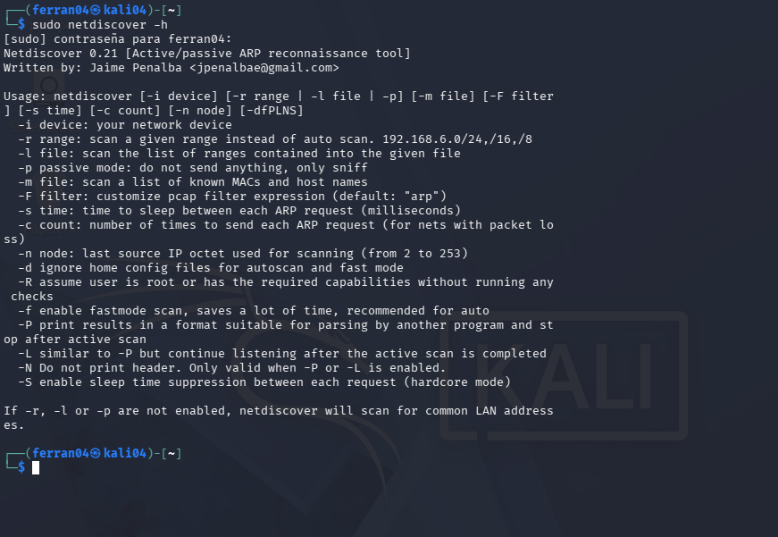
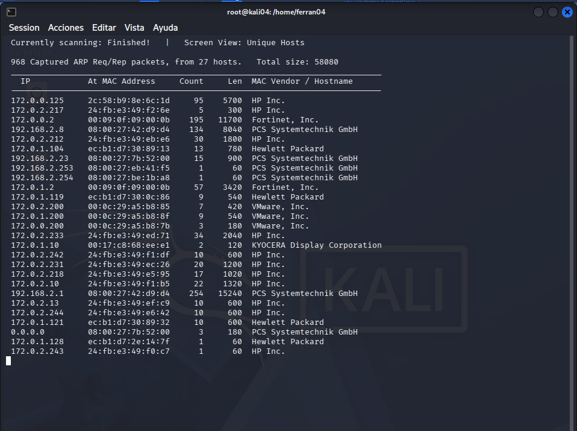
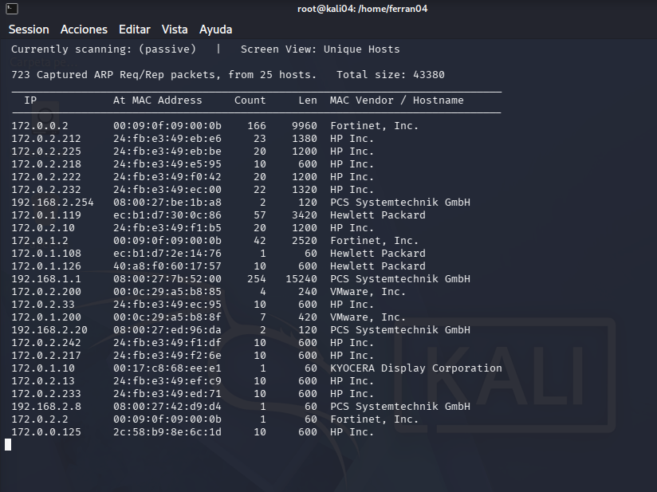
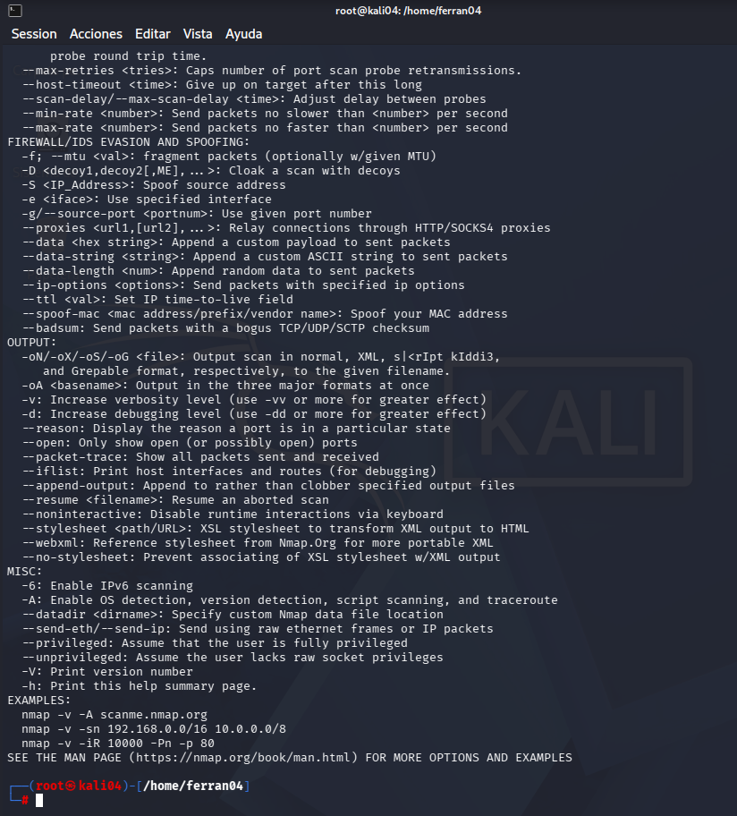
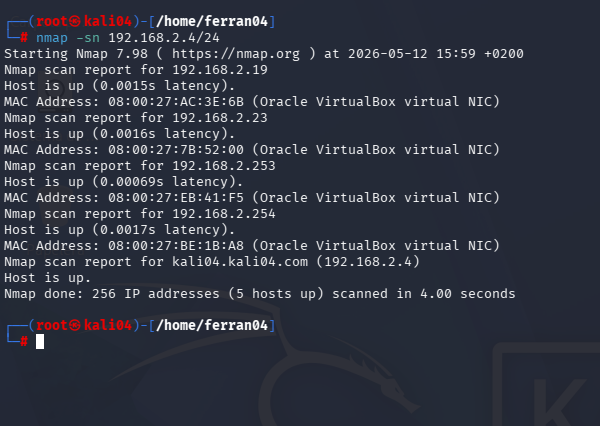
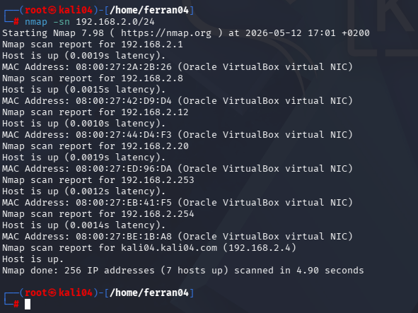
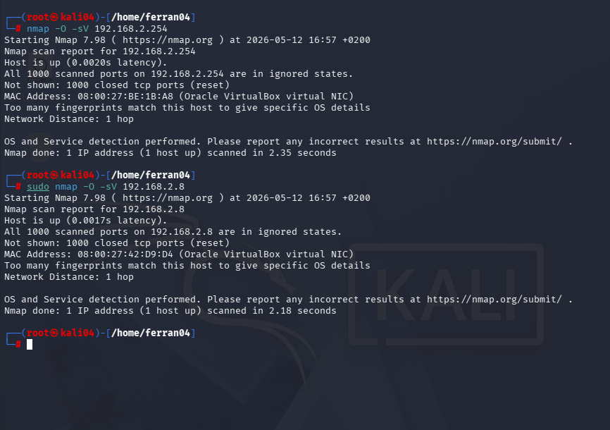

# Informe d’exploració de xarxa amb Kali Linux

**Autor:** Ferran04  
**Data:** 12 de maig de 2026  
**Xarxa assignada:** 192.168.2.0/24  
**IP de la màquina Kali:** 192.168.2.4  

A continuació es presenten les captures i explicacions de l’activitat d’exploració de xarxa local utilitzant **Netdiscover** i **Nmap**, seguint els criteris de la rúbrica.

---

## 1. Pantalla d’inici de sessió

**Descripció:**  
Pantalla de benvinguda (login) de la màquina virtual Kali Linux. Hi apareixen l’usuari `ferran04` i el nom de la màquina `kali04`.

**Per a què serveix:**  
Identifica l’entorn de treball abans de començar les exploracions de xarxa.

---

## 2. Ajuda de l’eina Netdiscover

**Descripció:**  
Sortida de la comanda `sudo netdiscover -h`, que mostra totes les opcions disponibles de l’eina: especificar rang (`-r`), mode passiu (`-p`), triar interfície (`-i`), etc.

**Per a què serveix:**  
Consultar els paràmetres per adaptar l’exploració a les necessitats concretes (xarxa, mode actiu/passiu, velocitat).

---

## 3. Netdiscover – mode actiu

**Descripció:**  
Resultat d’executar `netdiscover` sense restringir el rang (no s’ha usat `-r`). S’han capturat 968 paquets ARP procedents de 27 hosts. S’observen adreces IP de diferents àmbits: `172.0.x.x` (majoria), `192.168.2.x` (8, 23, 253, 254, 1) i fins i tot `0.0.0.0`. El dispositiu `192.168.2.1` apareix amb un alt nombre de paquets.

**Per a què serveix:**  
Detectar equips connectats a la xarxa local mitjançant l’enviament actiu de peticions ARP. Aquest mètode és ràpid i exhaustiu, però genera trànsit.

---

## 4. Netdiscover – mode passiu

**Descripció:**  
Execució de `netdiscover -p` (només escolta, no envia paquets). S’han capturat 723 paquets ARP de 25 hosts. Es barregen IPs `172.0.x.x`, `192.168.2.x` (254, 20, 8) i també apareix una IP `192.168.1.1`.

**Per a què serveix:**  
Escoltar el trànsit ARP de manera silenciosa per identificar equips sense generar alertes. És un mètode més furtiu, però depèn que els dispositius ja estiguin comunicant-se.

---

## 5. Diferències entre mode actiu i passiu de Netdiscover

En l’exploració realitzada es van utilitzar dos modes diferents: **actiu** (sense especificar rang) i **passiu** (amb `-p`).

### Resultats obtinguts

- **Mode actiu:** 968 paquets ARP, 27 hosts. Es van detectar moltes IPs `172.0.x.x` (HP, Fortinet, VMware) i algunes de `192.168.2.x` (`192.168.2.8`, `192.168.2.23`, `192.168.2.253`, `192.168.2.254` –aquest darrer és el router de l’escola– i `192.168.2.1`). Aquest mode envia activament peticions ARP, és exhaustiu i ràpid però genera trànsit detectable per sistemes IDS.

- **Mode passiu:** 723 paquets ARP, 25 hosts. Majoritàriament IPs `172.0.x.x`, però també `192.168.2.254` (router), `192.168.2.20`, `192.168.2.8` i `192.168.1.1`. No envia cap paquet, només escolta. És més furtiu però només detecta equips que ja estan generant o responent a peticions ARP.

### Taula comparativa

| Aspecte | Mode actiu | Mode passiu |
|---------|------------|-------------|
| Envia paquets | Sí (peticions ARP) | No |
| Furtivitat | Baixa (genera trànsit detectable) | Alta (només escolta) |
| Capacitat de detecció | Detecta pràcticament tots els hosts (si responen) | Detecta només hosts que ja estan actius |
| Temps d’exploració | Ràpid (uns segons) | Depèn del trànsit existent |
| Ús recomanat | Inventari complet, anàlisi inicial | Reconeixement silenciós, evasió d’IDS |

**Conclusió personal:**  
El mode actiu va detectar més hosts `192.168.2.x` (5 o 6) que el passiu (3 o 4), perquè alguns equips no estaven generant trànsit ARP durant l’escolta. La presència massiva d’IPs `172.0.x.x` en ambdós modes indica que la interfície de xarxa està rebent trànsit d’altres VLANs, dificultant una anàlisi exclusiva de la xarxa `192.168.2.0/24`.

---

## 6. Ajuda de l’eina Nmap

**Descripció:**  
Mostra el resum d’opcions de Nmap (`nmap -h`). S’hi destaquen paràmetres habituals com `-sn` (ping scan), `-sV` (detecció de versions), `-O` (detecció de SO) i `-A` (escaneig complet).

**Per a què serveix:**  
Recordar les opcions necessàries per als diferents tipus d’exploració demanats a la tasca.

---

## 7. Nmap – descobriment ràpid de hosts (primer intent)

**Descripció:**  
Execució de `nmap -sn 192.168.2.4/24`. L’escaneig detecta 5 hosts actius dins del rang `192.168.2.0/24`: `192.168.2.19`, `192.168.2.23`, `192.168.2.253`, `192.168.2.254` i la pròpia màquina `192.168.2.4`. Totes les adreces MAC corresponen a targetes virtuals d’Oracle (VirtualBox).

**Per a què serveix:**  
Identificar quins dispositius responen a les probes ICMP/ARP a la xarxa local, sense escanejar ports.

---

## 8. Nmap – descobriment ràpid de hosts (correcte amb rang complet)

**Descripció:**  
Execució de `sudo nmap -sn 192.168.2.0/24`. Aquesta comanda realitza un *ping scan* a tota la xarxa `192.168.2.0/24`. Els resultats mostren **7 hosts actius**:

- `192.168.2.1`
- `192.168.2.8` (servidor Ubuntu)
- `192.168.2.12`
- `192.168.2.20`
- `192.168.2.253`
- `192.168.2.254` (router de l’escola)
- `192.168.2.4` (màquina Kali)

**Per a què serveix:**  
Identificar tots els dispositius que responen a la xarxa local sense escanejar ports. És l’exploració més neta i completa per a l’inventari.

---

## 9. Nmap – detecció de ports i sistema operatiu

**Descripció:**  
Execució de `nmap -O -sV` sobre els dos equips clau de la xarxa:

### 9.1 Router de l’escola (`192.168.2.254`)

- `nmap -O -sV 192.168.2.254`
- **Resultat:** Tots els 1000 ports TCP analitzats estan **tancats** (estat `closed`). Això és habitual en routers amb tallafocs restrictiu.
- No es pot determinar el sistema operatiu amb precisió perquè hi ha massa coincidències (`Too many fingerprints match`), però es confirma que és un dispositiu de xarxa virtualitzat amb VirtualBox.
- Distància de 1 salt.

### 9.2 Servidor Ubuntu (`192.168.2.8`)

- `sudo nmap -O -sV 192.168.2.8`
- **Resultat:** També tots els 1000 ports tancats. Indica que el servidor no té serveis exposats (pot ser un sistema mínim o amb firewall actiu).
- Novament, no s’obté un SO concret per excés de coincidències, però es confirma que és una màquina virtual Oracle.

**Per a què serveix:**  
Determinar quins ports estan oberts en els dispositius crítics (router i servidor) i intentar endevinar el sistema operatiu. En aquest cas, els ports tancats i la manca de serveis visibles suggereixen una configuració segura o bé que els serveis estan filtrats.

---

