# Tasca: Integració d'un client Linux a un domini Active Directory

## Descripció general
En aquesta pràctica es realitza la integració d'un client Linux (Zorin OS) a un domini Active Directory `FOODLOGISTIC.TEST`, configurant l'autenticació mitjançant SSSD i permetent l'accés d'usuaris i grups del domini.

---

## 1. Creació de la Unitat Organitzativa (OU) al servidor AD

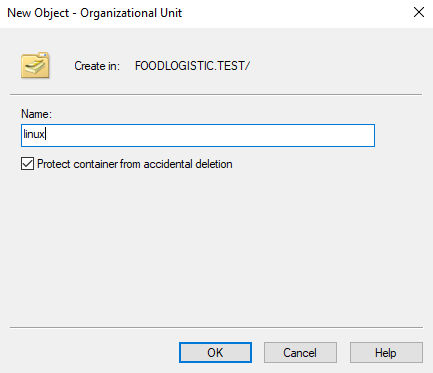

Es crea una nova Unitat Organitzativa anomenada `linux` dins del domini `FOODLOGISTIC.TEST`. Aquesta OU servirà per allotjar els equips Linux que s'integrin al domini. Es marca l'opció de protegir el contenidor contra eliminació accidental.

---

## 2. Visualització de la Unitat Organitzativa creada

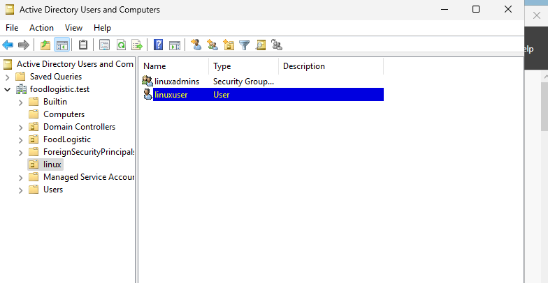

Des de l'eina "Active Directory Users and Computers" es pot observar la nova OU `linux` creada correctament. També es visualitza el grup de seguretat `linuxadmins` que posteriorment s'utilitzarà per gestionar permisos.

---

## 3. Configuració de xarxa del client Linux

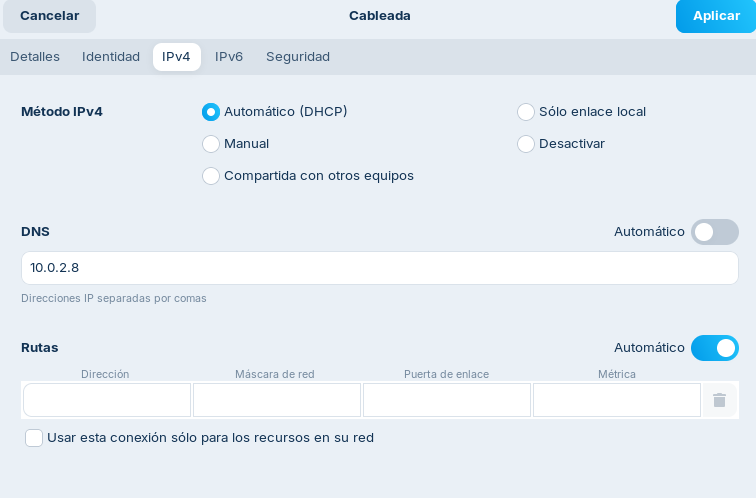

Es configura la interfície de xarxa del client Linux amb IP manual o mitjançant DHCP. En aquest cas, és important configurar el servidor DNS amb l'adreça del controlador de domini (`10.0.2.8`), ja que serà necessari per resoldre el domini `FOODLOGISTIC.TEST`.

---

## 4. Instal·lació dels paquets necessaris

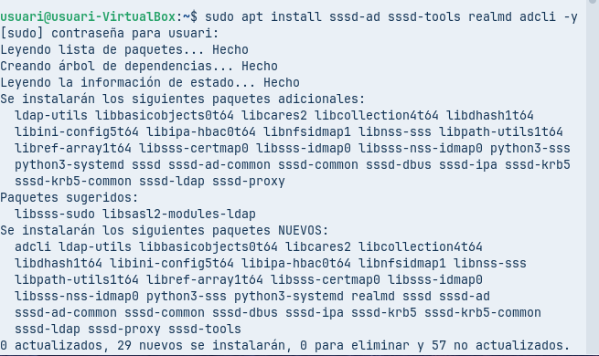

S'instal·len els paquets necessaris per a la integració amb Active Directory: `sssd`, `sssd-tools`, `realmd`, `adcli`. Aquestes eines permeten descobrir el domini, unir-s'hi i gestionar l'autenticació.

```bash
sudo apt install sssd sssd-tools realmd adcli -y
```

---

## 5. Configuració del nom de l'equip

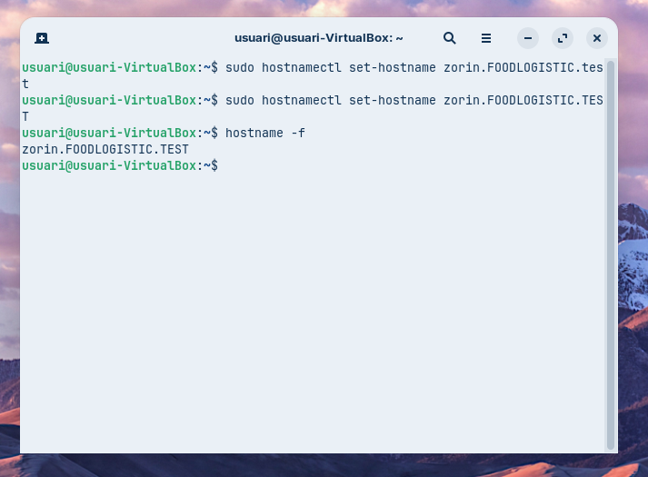

S'estableix el nom complet del client Linux com `zorin.foodlogistic.test` utilitzant `hostnamectl`. Es verifica que el canvi s'ha aplicat correctament amb `hostname -f`.

```bash
sudo hostnamectl set-hostname zorin.foodlogistic.test
hostname -f
```

---

## 6. Verificació de la data i hora

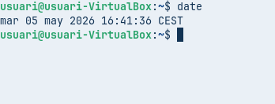

Es comprova que la data i hora del sistema estiguin correctes. Per a l'autenticació Kerberos és fonamental que el client i el controlador de domini tinguin la sincronització horària adequada.

---

## 7. Confirmació de la data des de l'entorn gràfic

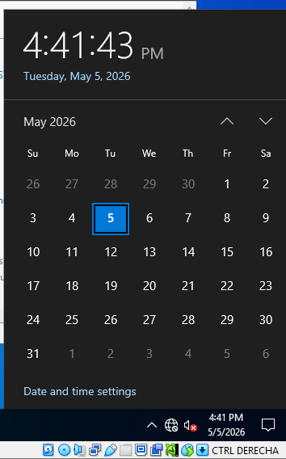

Des de l'entorn gràfic es confirma que la data és correcta (`dimarts, 5 de maig de 2026`). Aquesta sincronització és crítica per a la correcta autenticació Kerberos.

---

## 8. Descobriment del domini

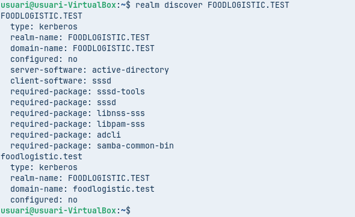

Es realitza el descobriment del domini `FOODLOGISTIC.TEST` amb `realm discover`. La comanda mostra informació del domini, incloent que és un domini Active Directory i els paquets necessaris per a la integració.

```bash
realm discover FOODLOGISTIC.TEST
```

---

## 9. Unió del client al domini

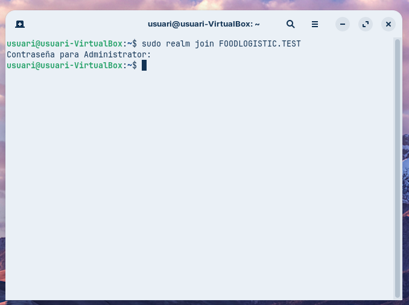

S'executa la comanda per unir l'equip `zorin` al domini `FOODLOGISTIC.TEST`. Es demana la contrasenya de l'usuari administrador del domini per completar l'operació.

```bash
sudo realm join FOODLOGISTIC.TEST
```

---

## 10. Verificació des del servidor Active Directory

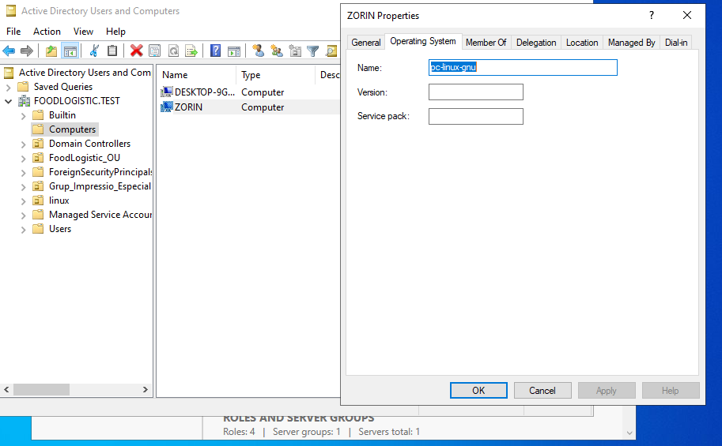

Des del servidor AD es verifica que l'equip `ZORIN` apareix correctament registrat dins la Unitat Organitzativa `linux`. Això confirma que la unió al domini ha estat exitosa.

---

## 11. Habilitació del directori personal automàtic

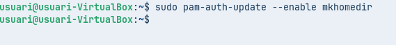

S'executa `sudo pam-auth-update` i s'activa l'opció `Create home directory on login`. Això permet que quan un usuari del domini iniciï sessió per primera vegada, es creï automàticament el seu directori `home`.

---

## 12. Inici de sessió amb usuari del domini

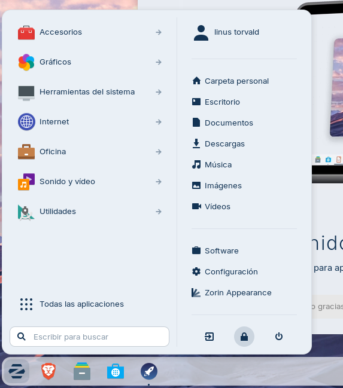

A la pantalla d'inici de sessió del Zorin OS, és possible seleccionar l'usuari del domini `linux` (format `u_linux@FOODLOGISTIC.TEST`) per autenticar-se. Es pot introduir manualment el nom d'usuari en format UPN.

---

## 13. Sessió iniciada amb l'usuari del domini

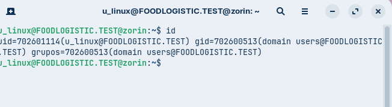

Un cop iniciada la sessió, el terminal mostra que l'usuari actual és `u_linux@FOODLOGISTIC.TEST`, confirmant que l'autenticació contra el domini ha funcionat correctament.

---

## 14. Configuració de privilegis sudo per als administradors del domini

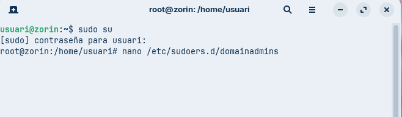

Es crea un fitxer dins `/etc/sudoers.d/domainadmins` per atorgar privilegis `sudo` als usuaris i grups del domini. Primer s'accedeix com a `root` mitjançant `sudo su`.

```bash
sudo su
nano /etc/sudoers.d/domainadmins
```

---

## 15. Contingut del fitxer sudoers per a domain admins

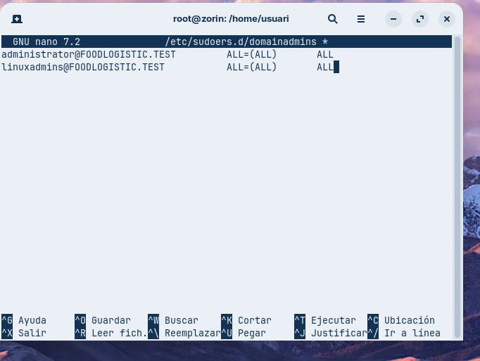

El fitxer `domainadmins` conté les línies que permeten a l'usuari `administrator` i al grup `linuxadmins` del domini executar qualsevol comanda amb privilegis `sudo`. El format utilitza `%` per indicar grups.

```
administrator@FOODLOGISTIC.TEST    ALL=(ALL)    ALL
%linuxadmins@FOODLOGISTIC.TEST    ALL=(ALL)    ALL
```

---

## 16. Prova de privilegis sudo amb usuari del domini

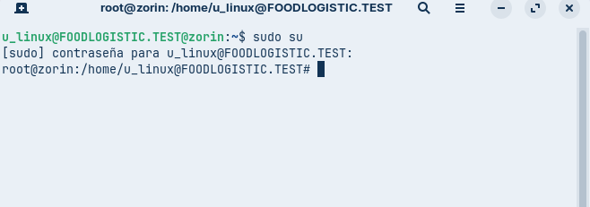

L'usuari `u_linux@FOODLOGISTIC.TEST` executa `sudo su` i, després d'introduir la seva contrasenya, obté accés com a `root`. Això confirma que la configuració de `sudo` funciona correctament per als membres del grup `linuxadmins`.

---

## 17. Restricció d'accés al domini

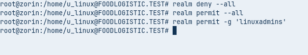

Es configuren les polítiques d'accés per permetre només l'inici de sessió als membres del grup `linuxadmins`. Primer es denega l'accés a tots els usuaris i després es permet específicament al grup.

```bash
realm deny --all
realm permit -g 'linuxadmins'
```

---

## 18. Instal·lació de suport per a SMB/CIFS

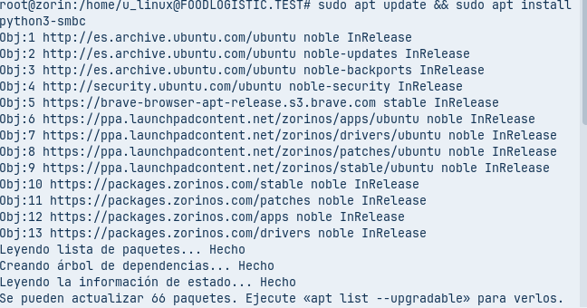

S'instal·la el paquet `python3-smbc` per proporcionar suport a SMB/CIFS des de Python. Aquest paquet pot ser útil per accedir a recursos compartits del domini mitjançant aplicacions desenvolupades en Python.

```bash
sudo apt update && sudo apt install python3-smbc
```

---

## 19. Accés als recursos compartits del domini

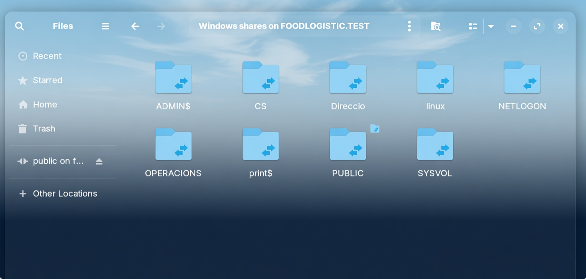

Des del gestor d'arxius del Zorin OS, es visualitzen els recursos compartits del domini `FOODLOGISTIC.TEST`. Es poden veure les carpetes administratives (`ADMIN$`, `C$`), recursos compartits creats (`linux`, `PUBLIC`, `OPERACIONS`) i directoris del sistema (`NETLOGON`, `SYSVOL`).

---

## Resum de la pràctica

En aquesta tasca s'ha aconseguit:
1. Preparar un servidor Active Directory amb una OU específica per a equips Linux
2. Configurar un client Linux (Zorin OS) perquè apunti al DNS del controlador de domini
3. Instal·lar les eines necessàries (`realmd`, `sssd`, `adcli`)
4. Unir el client al domini `FOODLOGISTIC.TEST`
5. Configurar l'autenticació amb directori personal automàtic
6. Establir privilegis `sudo` per a grups del domini
7. Restringir l'accés perquè només el grup `linuxadmins` pugui iniciar sessió
8. Accedir als recursos compartits del domini des del client Linux

