# Tasca de configuració d'IPFire: Proxy i filtre de continguts

A continuació es mostren les captures de pantalla del procés de configuració d'IPFire com a proxy web amb filtre d'URL, juntament amb regles de tallafoc. Cada imatge porta una breu explicació del que s'hi realitza.

## Captura 1

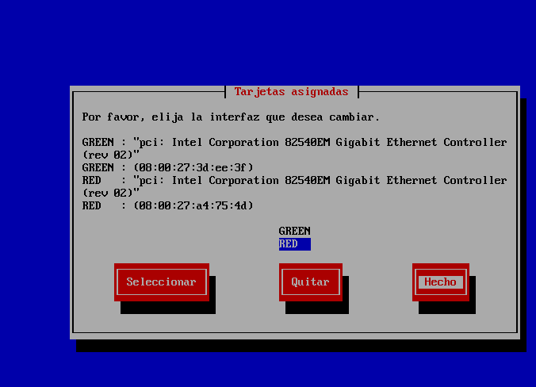

**Explicació:**  
Assignació de les interfícies de xarxa a IPFire. Es mostren les targetes **GREEN** (xarxa interna) i **RED** (xarxa externa o WAN), amb les seves adreces MAC i el model de controladora Intel.

## Captura 2

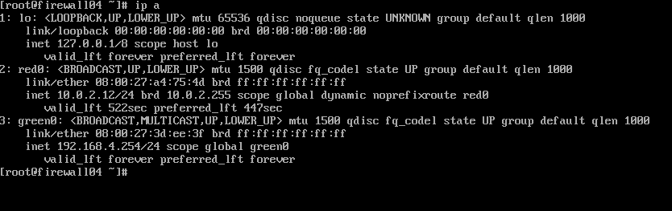

**Explicació:**  
Execució de la comanda `ip a` al sistema. Es pot veure la interfície `red0` amb IP `10.0.2.12/24` (obtinguda per DHCP) i la interfície `green0` amb IP estàtica `192.168.4.254/24`. Aquesta última serà la passarel·la per als clients de la xarxa interna.

## Captura 3

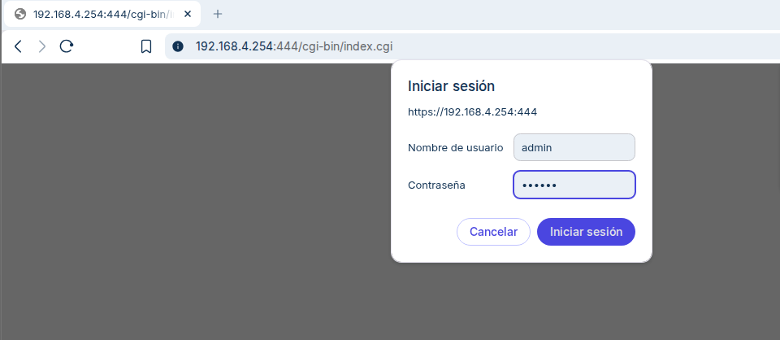

**Explicació:**  
Pàgina d'inici de sessió de l'entorn web d'IPFire, accessible mitjançant `https://192.168.4.254:444`. Es l'accedeix amb l'usuari `admin` i la contrasenya corresponent per a gestionar el firewall i el proxy.

## Captura 4

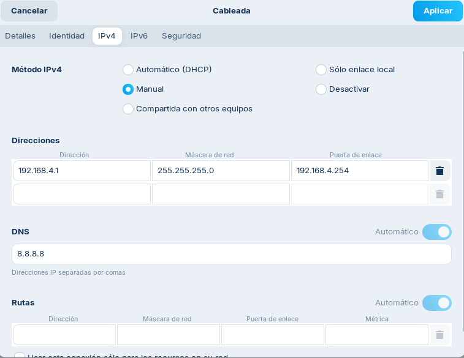

**Explicació:**  
Configuració manual de la IP d'un client o d'una interfície de xarxa interna. S'estableix l'adreça `192.168.4.1/24`, la passarel·la a `192.168.4.254` (el propi IPFire) i el DNS `8.8.8.8`. Aquest pas és típic per a configurar un equip de la xarxa GREEN.

## Captura 5

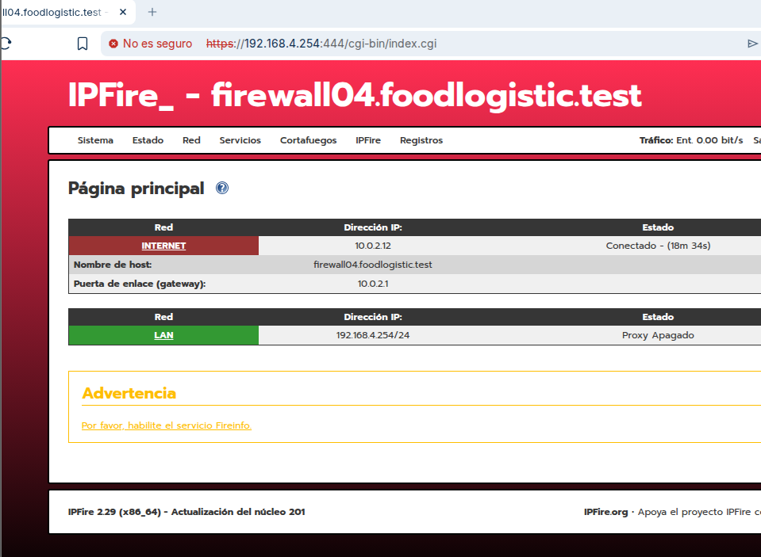

**Explicació:**  
Panell de control principal d'IPFire (dashboard). Es confirma el nom del host `firewall04.foodlogistic.test`, la IP de GREEN (`192.168.4.254/24`), la IP de RED (`10.0.2.12`) i la passarel·la per defecte `10.0.2.1`. L'estat del proxy apareix com a "Apagat".

## Captura 6

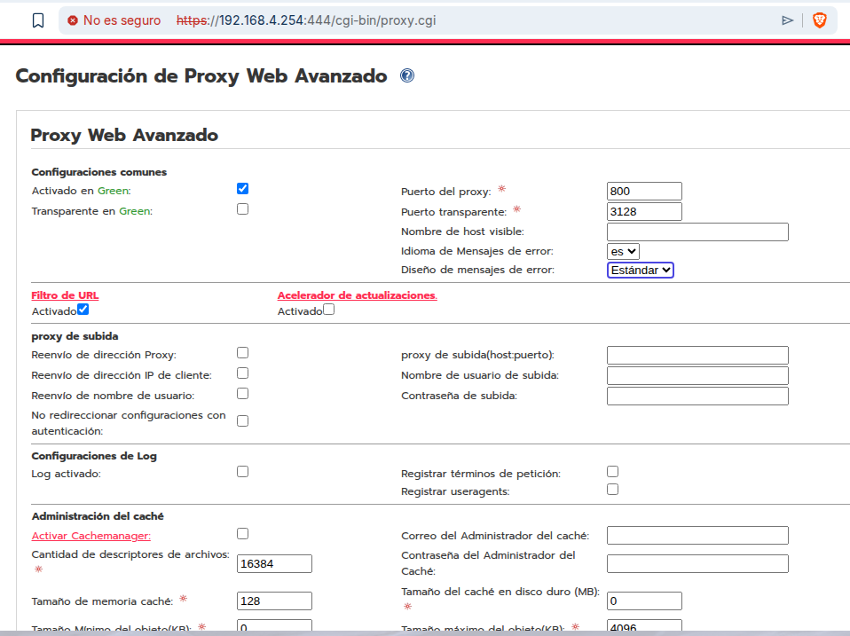

**Explicació:**  
Configuració avançada del proxy web. El proxy està **desactivat** a GREEN (no està marcat "Activado en Green" ni "Transparente en Green"). El port del proxy és el `800` i el port transparent el `3128`. El filtre d'URL i l'accelerador d'actualitzacions estan activats.

## Captura 7

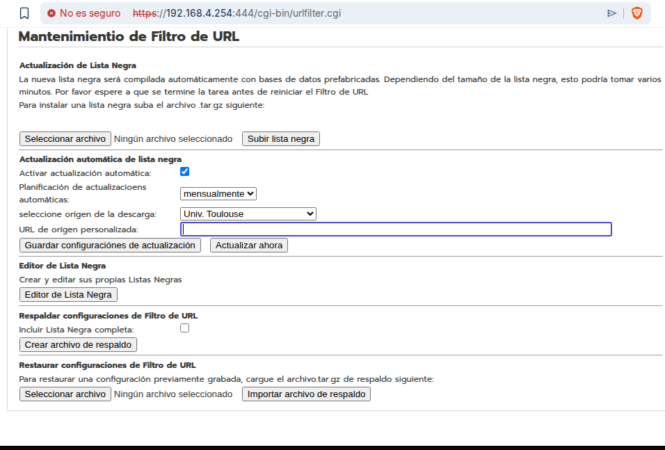

**Explicació:**  
Manteniment del filtre d'URL. Es permet actualitzar la llista negra (blacklist) manualment pujant un fitxer `.tar.gz` o mitjançant actualització automàtica des d'un repositori (per exemple, Universitat de Tolosa). També hi ha opcions de còpia de seguretat i restauració.

## Captura 8

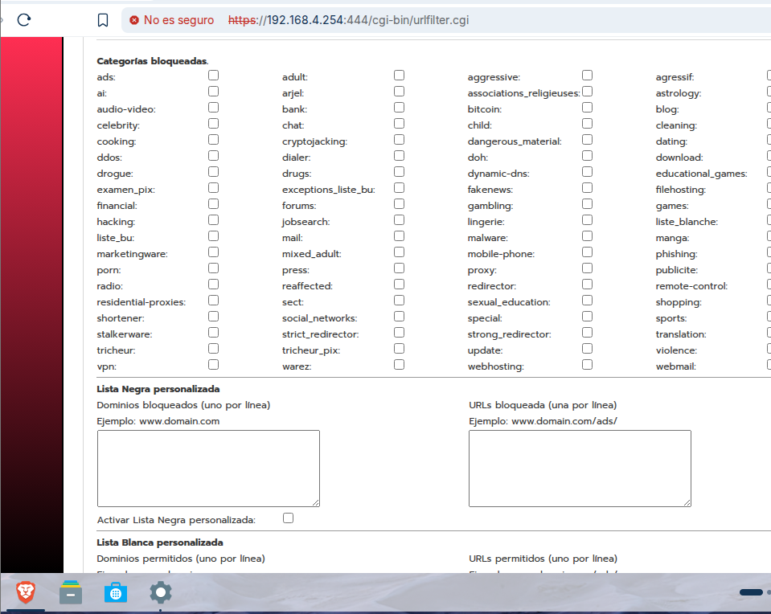

**Explicació:**  
Llistat de categories bloquejades pel filtre d'URL. Es mostren categories com `ads`, `adult`, `porn`, `violence`, `vpn`, etc. A més, hi ha la secció per a definir **llista negra personalitzada** (dominis o URL bloquejats) i **llista blanca personalitzada** (permesos).

## Captura 9

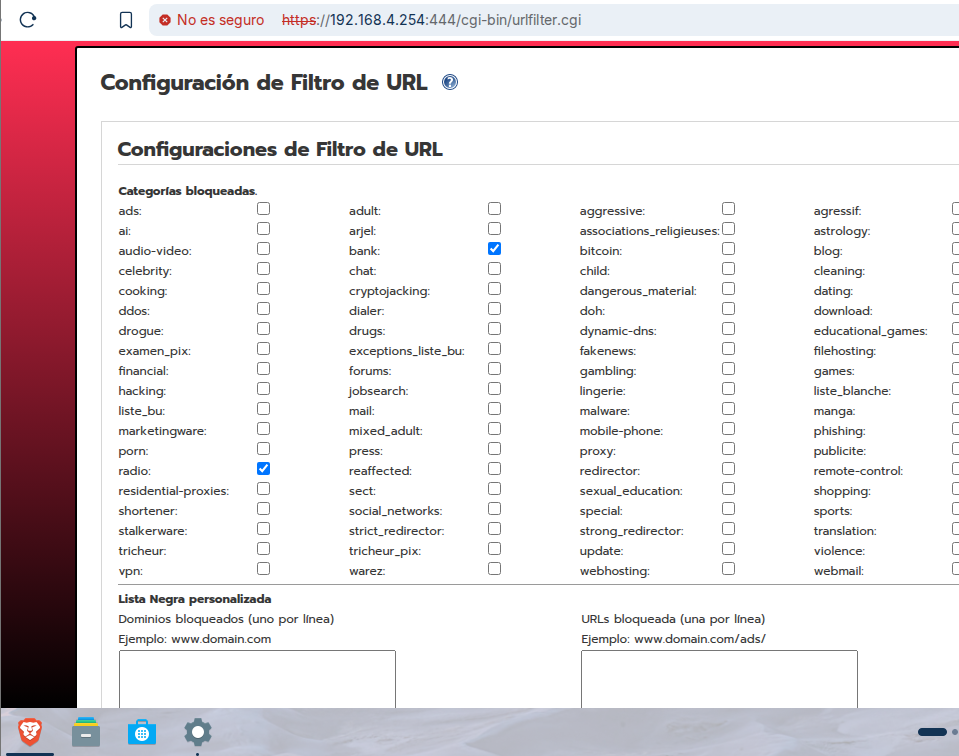

**Explicació:**  
Continuació de la configuració de categories bloquejades. Es repeteixen moltes categories; en aquesta vista encara no n'hi ha cap marcada. També es mostra l'espai per a la llista negra personalitzada (dominis i URLs).

## Captura 10

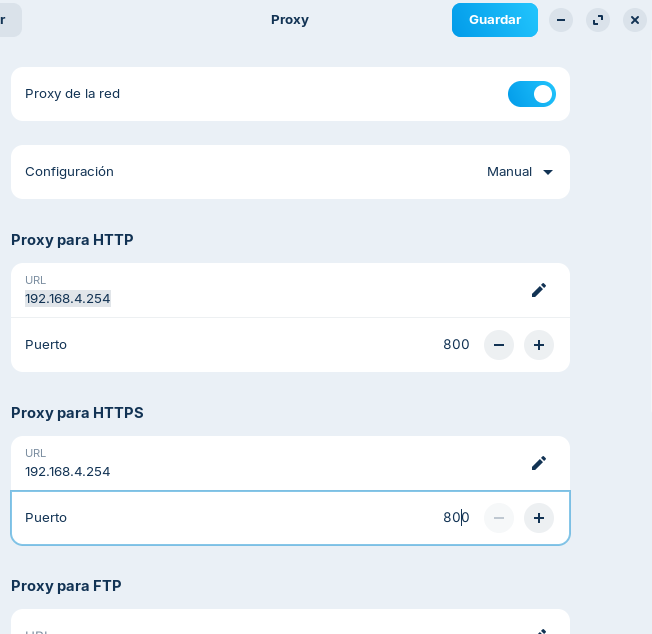

**Explicació:**  
Configuració del proxy a nivell de client (navegador o sistema operatiu). S'estableix el proxy manual per a HTTP i HTTPS amb URL `192.168.4.254` i port `800`. Hi ha un error tipogràfic al port HTTPS que posa `80p` en lloc de `800`.

## Captura 11

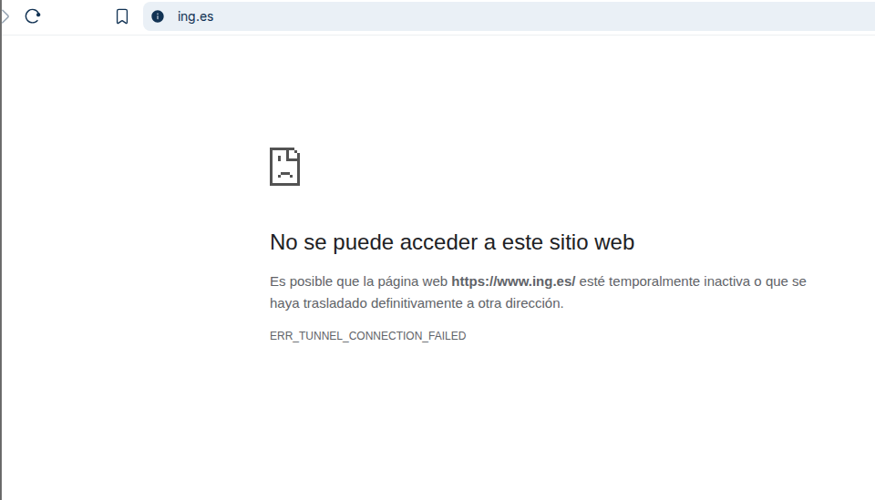

**Explicació:**  
Error en intentar accedir a `https://www.ing.es/`. El missatge `ERR_TUNNEL_CONNECTION_FAILED` indica un problema amb el túnel del proxy, probablement perquè el proxy encara no està actiu o la configuració del client no és correcta.

## Captura 12

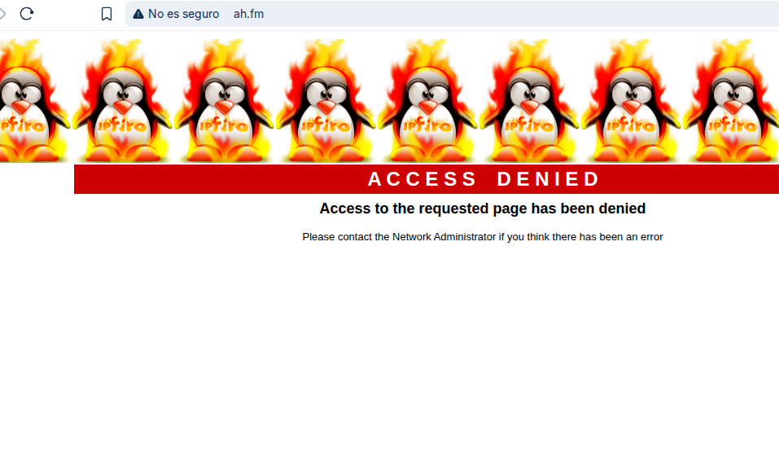

**Explicació:**  
Accés denegat al lloc `ah.fm`. Apareix el missatge `ACCESS DENIED` del filtre d'URL, cosa que indica que el domini o alguna categoria associada està bloquejada.

## Captura 13

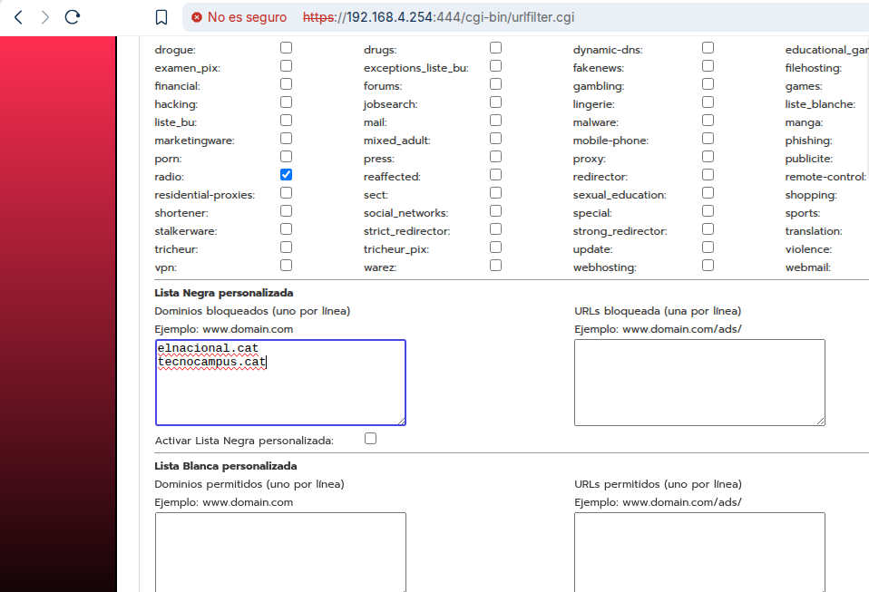

**Explicació:**  
Configuració del filtre d'URL on es marca la categoria **`radio`** amb una `[x]`. Això bloquejarà tot lloc web classificat dins de la categoria "ràdio". La resta de categories romanen desmarcades (permeses).

## Captura 14

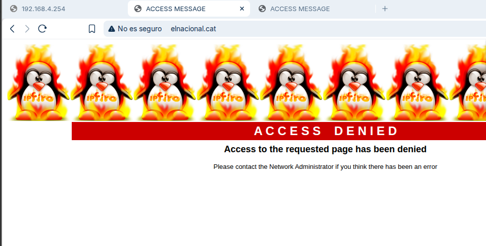

**Explicació:**  
Intent d'accés al diari digital `elnacional.cat`. El filtre d'URL denega l'accés (ACCESS DENIED) perquè el domini s'ha inclòs a la llista negra personalitzada (com es veurà més endavant).

## Captura 15

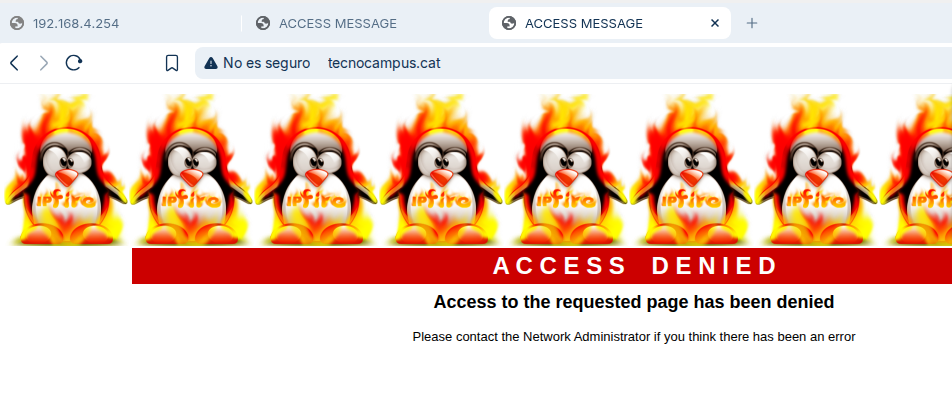

**Explicació:**  
Accés denegat al domini `tecnocampus.cat`. Igual que en el cas anterior, aquest domini està bloquejat manualment per la llista negra personalitzada.

## Captura 16

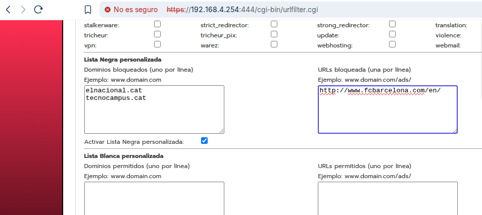

**Explicació:**  
Llista negra personalitzada on s'han afegit els dominis: `http://www.fcbarcelona.com/en/`, `elnacional.cat`, `tecnocampus.cat`. No està activada (checkbox sense marcar), però els blocs observats a les captures 14 i 15 indiquen que potser sí que ho estava en algun moment. També es pot veure l'opció per activar-la.

## Captura 17

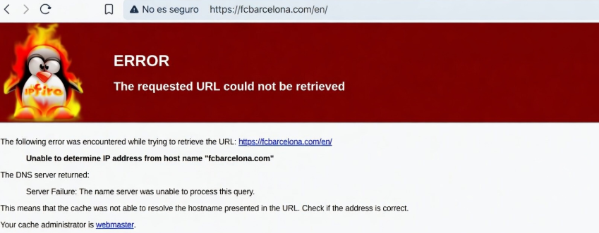

**Explicació:**  
Error en accedir a `fcbarcelona.com/en/`. El missatge indica un problema de resolució DNS: "Server Failure". No és un bloqueig directe del filtre, sinó que el servidor DNS no pot resoldre el nom. Posteriorment es veu que el lloc sí que funciona en una altra URL.

## Captura 18

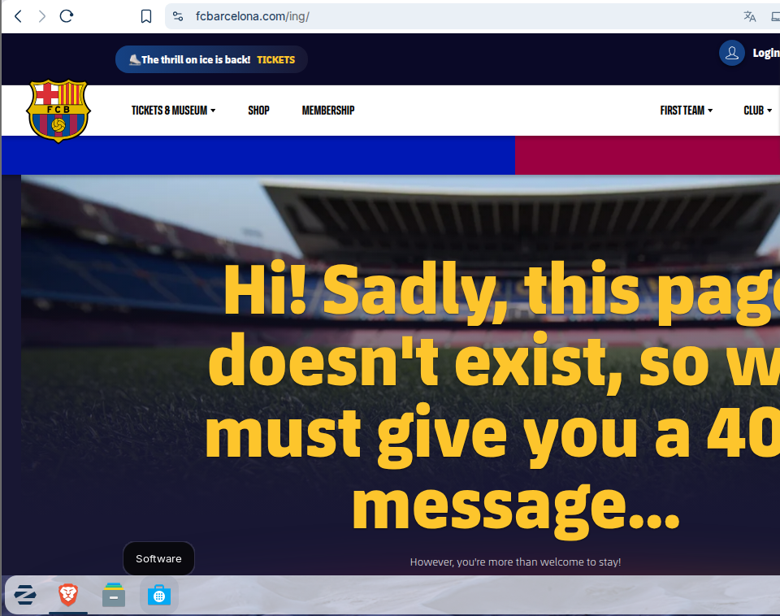

**Explicació:**  
Accés a `fcbarcelona.com/ing/`. En aquest cas el lluc carrega, però la pàgina retorna un error 404 (no existeix). No és un bloqueig del proxy, sinó un error del propi lloc web.

## Captura 19

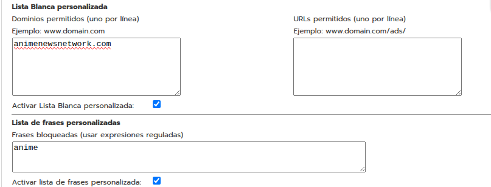

**Explicació:**  
Llista blanca personalitzada. S'hi afegeix el domini `animenewnetwork.com` (amb un error tipogràfic, falta una 's'? Hauria de ser `animenewsnetwork.com`). A més, s'activa una llista de frases bloquejades amb la paraula `anime` (mitjançant expressió regular). Això permetrà bloquejar pàgines que continguin la paraula "anime" però desbloquejar'n alguna específica amb la llista blanca.

## Captura 20

**Explicació:**  
Accés correcte al lloc `animenewsnetwork.com`. Com que s'ha posat a la llista blanca, el proxy permet la navegació malgrat que la frase "anime" estigui bloquejada. Es mostra el contingut normal del portal d'actualitat d'anime.

## Captura 21

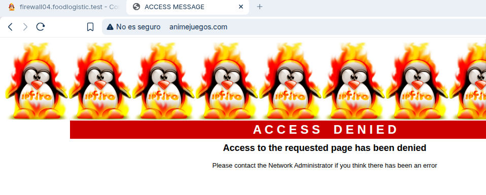

**Explicació:**  
Accés denegat a `animejuegos.com`. Aquest domini no està a la llista blanca i conté la paraula "anime" en el nom; per tant, el filtre de frases bloqueja la pàgina (ACCESS DENIED).

## Captura 22

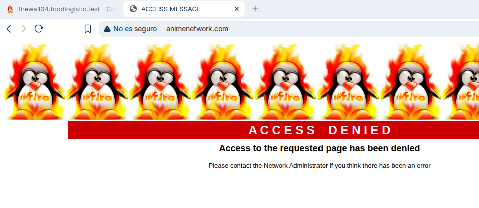

**Explicació:**  
Accés denegat a `animenetwork.com`. Tot i que és un domini diferent, també conté la cadena "anime" i no està a la llista blanca, per la qual cosa el proxy el denega.

## Captura 23

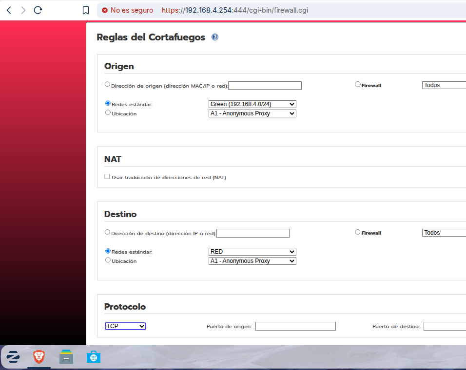

**Explicació:**  
Creació d'una regla de tallafoc (firewall). Es defineix l'origen (qualsevol, totes les xarxes), NAT activat, destinació a la xarxa RED, protocol TCP. Aquesta regla permetrà el trànsit des de GREEN cap a Internet.

## Captura 24

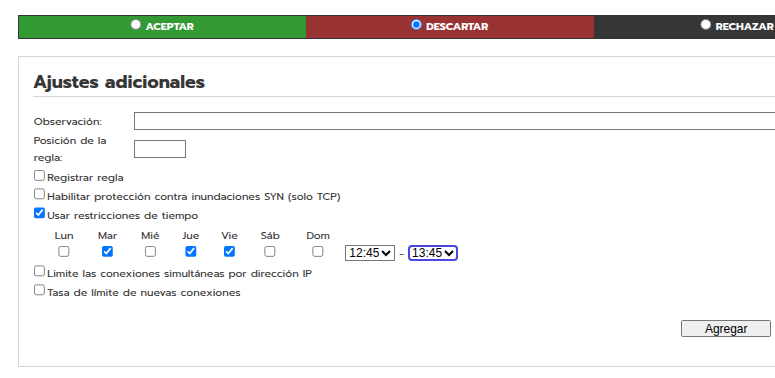

**Explicació:**  
Configuració addicional de la regla de tallafoc. S'habilita la restricció horària (`Usar restricciones de tiempo`) i es marquen els dies de la setmana (de dimarts a diumenge, excepte dilluns). Això permetrà que la regla només s'apliqui en franges horàries concretes (no es veu l'hora en aquesta captura, però es pot deduir que està definida en un altre lloc).

## Captura 25

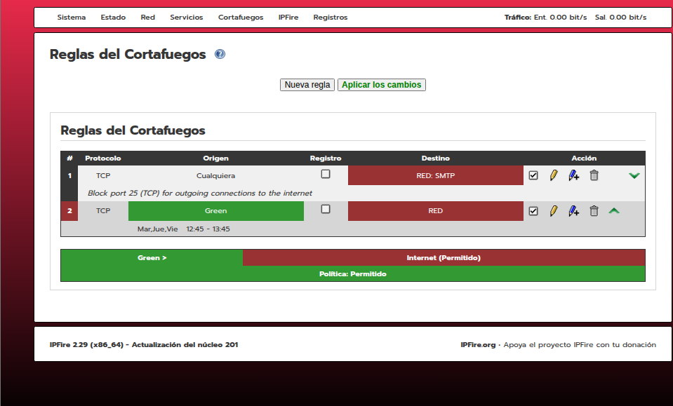

**Explicació:**  
Taula de regles del tallafoc un cop aplicades. Es mostren dues regles:
- Regla 1: TCP des de qualsevol origen cap a RED:SMTP.
- Regla 2: TCP des de GREEN cap a RED (Internet) amb restricció horària: dimarts, dijous, divendres de 12:45 a 13:45. Aquesta regla està permesa (política "Permitido").

La regla configura el pas del trànsit de navegació web a través del proxy i del filtre d'URL.

--- 
