# Tasca UD10: Servidor de fitxers amb Samba

## **Exercici 1: Instal·lació i configuració de SAMBA**

### 1.1 Instal·lació del servei Samba

Instal·lem el paquet Samba al servidor Ubuntu:

```bash
sudo apt install samba -y
```

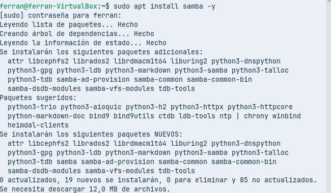
*Instal·lació del paquet Samba amb totes les seves dependències*

### 1.2 Creació de les carpetes compartides

Creem les carpetes `publica` i `compartida` a `/srv/samba/` amb els permisos adequats:

```bash
sudo mkdir -p /srv/samba/publica /srv/samba/compartida
sudo chmod 770 /srv/samba/publica /srv/samba/compartida
sudo chown :sambashare /srv/samba/publica /srv/samba/compartida
```

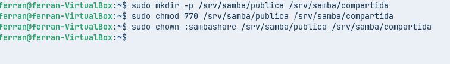
*Creació de les carpetes i assignació de permisos 770*

Verifiquem que les carpetes tenen la propietat correcta (`root:sambashare`) i permisos 770:

```bash
ls -ld /srv/samba/*
```

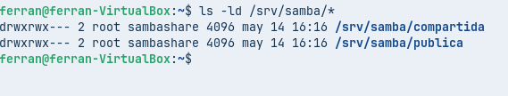
*Comprovació que les carpetes tenen propietat root i grup sambashare amb permisos 770*

### 1.3 Creació dels usuaris

Creem tres usuaris amb carpeta personal, sense accés local i pertanyents al grup `sambashare`:

```bash
sudo useradd -m -s /usr/sbin/nologin -G sambashare samba1
sudo useradd -m -s /usr/sbin/nologin -G sambashare samba2
sudo useradd -m -s /usr/sbin/nologin -G sambashare samba3
```

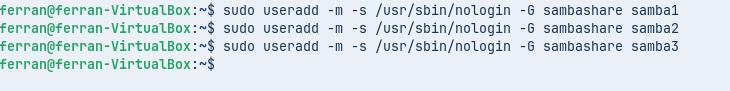
*Creació dels usuaris samba1, samba2 i samba3*

### 1.4 Afegir usuaris a Samba

Afegim els tres usuaris a la base de dades de Samba amb contrasenya:

```bash
sudo smbpasswd -a samba1
sudo smbpasswd -a samba2
sudo smbpasswd -a samba3
```

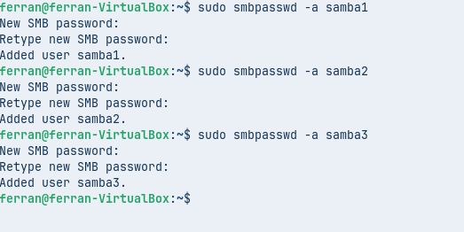
*Afegim els usuaris a Samba amb smbpasswd*

### 1.5 Copia de seguretat del fitxer de configuració

Fem una còpia de seguretat del fitxer original i en creem un de nou:

```bash
sudo mv /etc/samba/smb.conf /etc/samba/smb.conf.bak
sudo touch /etc/samba/smb.conf
```

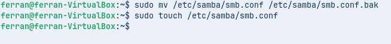
*Renombrem l'arxiu original i en creem un de nou buit*

---

## **Exercici 2: Accés a carpeta pública en mode anònim**

### 2.1 Configuració del fitxer smb.conf

Editem el fitxer de configuració:

```bash
sudo nano /etc/samba/smb.conf
```

Afegim la configuració per a la carpeta pública:

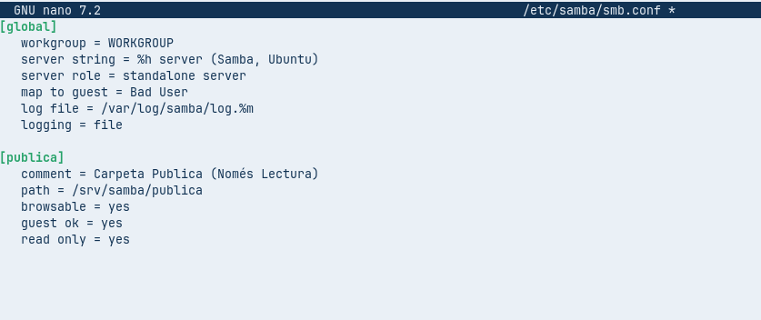
*Configuració inicial del fitxer smb.conf per la carpeta pública*

Verifiquem la sintaxi amb `testparm`:

```bash
testparm
```

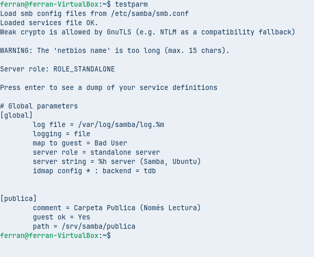
*Comprovació de la sintaxi del fitxer de configuració*

Reiniciem el servei Samba:

```bash
sudo systemctl restart smbd
```

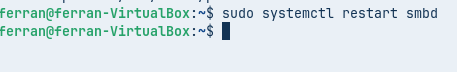
*Reinici del servei smbd*

### 2.2 Creació d'arxius de prova

Creem un fitxer de text dins la carpeta pública:

```bash
echo "ferran" | sudo tee /srv/samba/publica/fitxer_prova.txt
```

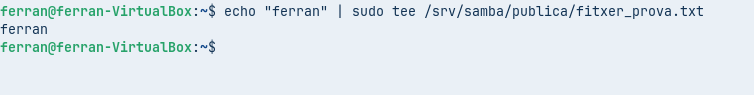
*Creació d'un fitxer de prova a la carpeta pública*

### 2.3 Comprovació d'accés anònim

Comprovem des del mateix servidor l'accés anònim:

```bash
smbclient //localhost/publica -N
```

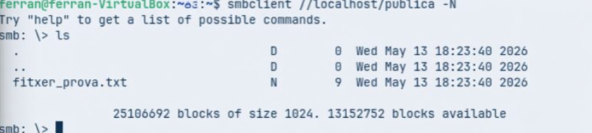
*Accés anònim a la carpeta pública amb smbclient*

Contingut final del `smb.conf` després de l'exercici 2 (afegint la secció [homes]):

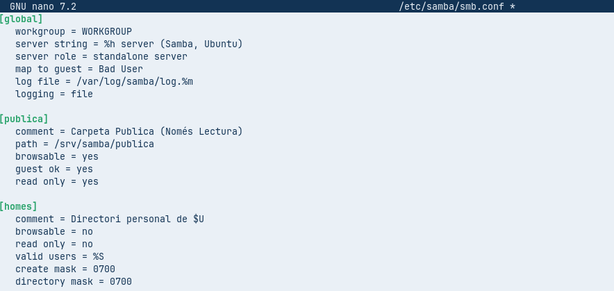
*Configuració completa incloent la secció [homes]*

Verifiquem de nou la configuració:

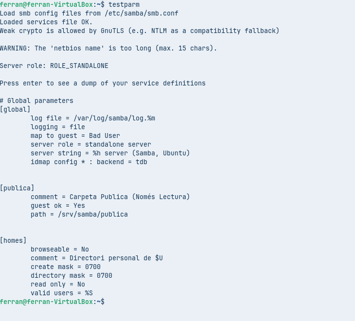
*Verificació final de la configuració amb testparm*

Reiniciem el servei:

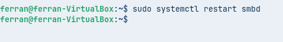
*Reinici del servei després de tota la configuració*

Obtenim la IP del servidor per connectar-nos des dels clients:

```bash
ip a
```

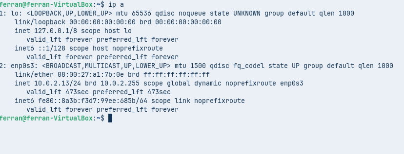
*IP del servidor: 10.0.2.13*

---

## **Exercici 3: Carpetes personals**

### 3.1 Configuració homes al smb.conf

La secció `[homes]` ja està configurada al fitxer (veure imatge 12). Aquesta configuració permet que cada usuari pugui accedir al seu directori personal.

### 3.2 Comprovació des de client Windows

Des de Windows, afegim una ubicació de xarxa especificant l'adreça del recurs compartit:


*Introduïm l'adreça \\10.0.2.13\samba1 per accedir a la carpeta personal de l'usuari samba1*

A continuació, donem un nom a la ubicació de xarxa:

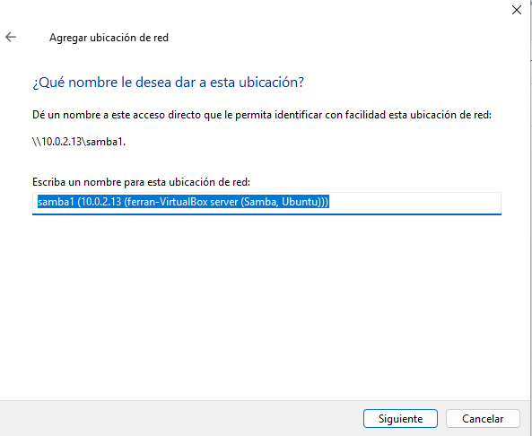
*Assignem un nom descriptiu per la ubicació de xarxa*

Accedim correctament a la carpeta personal:

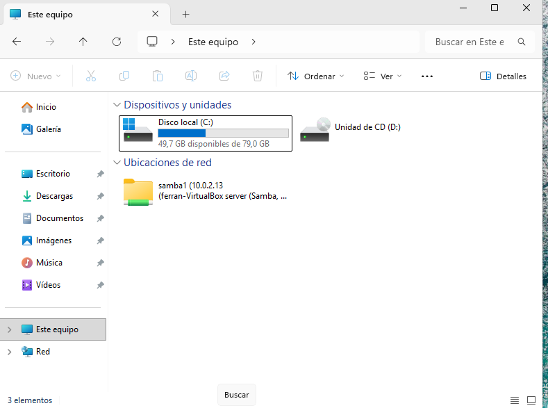
*Carpeta personal de l'usuari samba1 accessible des de Windows*

---

## **Exercici 4: Unitats compartides**

### 4.1 Configuració de la carpeta compartida

Afegim la secció `[compartida]` al `smb.conf`:

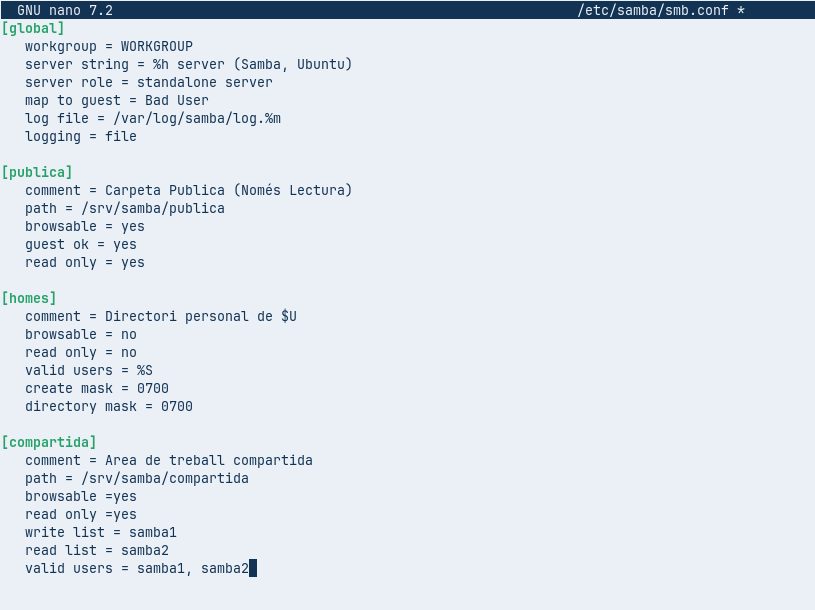
*Configuració de la carpeta compartida amb permisos diferenciats*

Verifiquem la configuració:

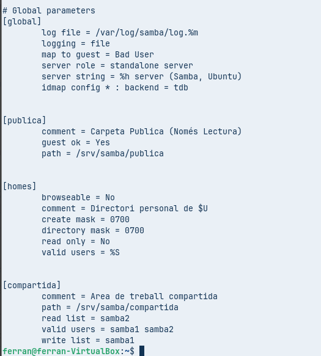
*Verificació de la configuració de la carpeta compartida*

Reiniciem el servei:

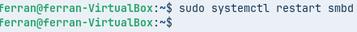
*Reinici del servei Samba*

### 4.2 Comprovació accés samba1 (Lectura/Escriptura)

Connectem amb l'usuari samba1:

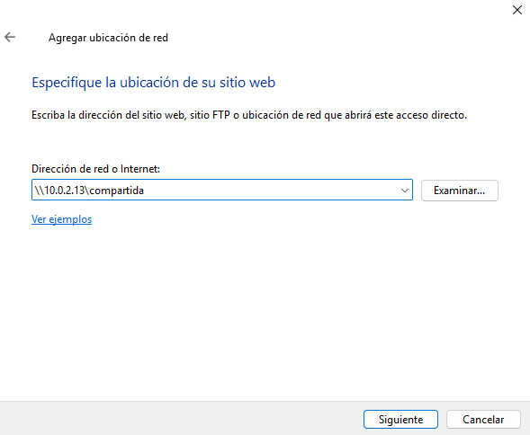
*Configuració de la connexió a la carpeta compartida*

Autenticació de l'usuari samba1:

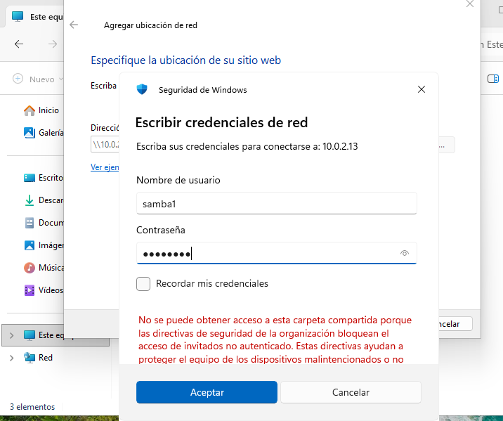
*Introduint credencials de samba1*

Accés correcte de samba1:

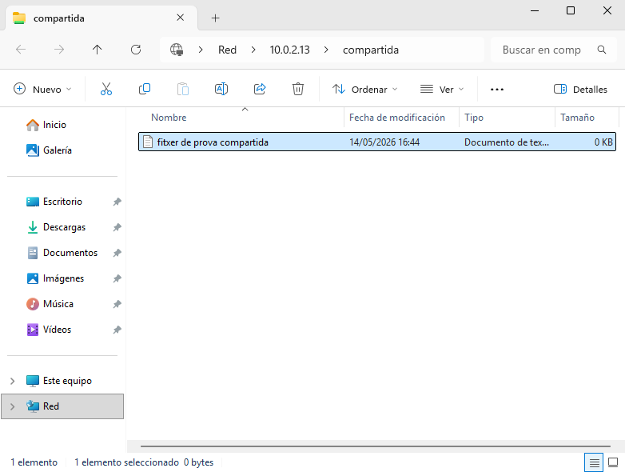
*L'usuari samba1 pot veure i modificar el contingut*

### 4.3 Comprovació accés samba2 (Només lectura)

L'usuari samba2 només pot llegir:

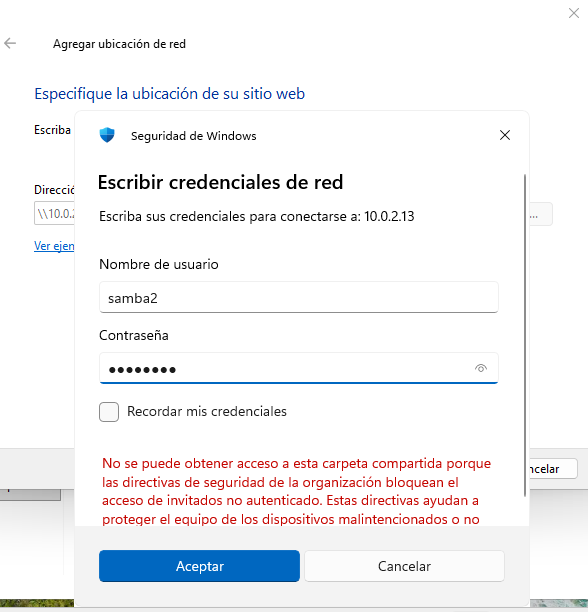
*Credencials de l'usuari samba2*

Error en intentar modificar:

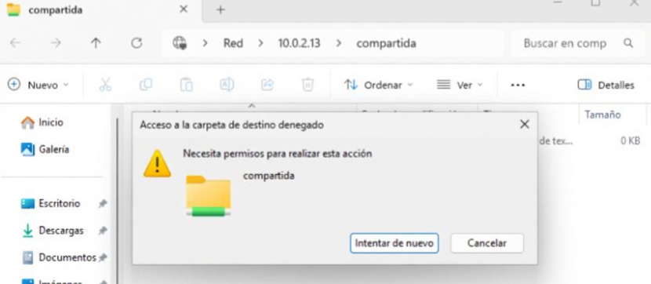
*L'usuari samba2 no pot modificar el fitxer (permís denegat)*

### 4.4 Comprovació accés samba3 (Sense accés)

L'usuari samba3 no pot accedir:

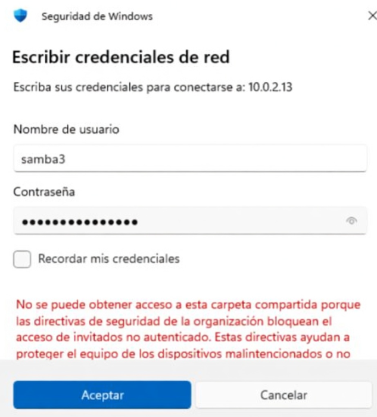
*L'usuari samba3 no té accés a la carpeta compartida*

### 4.5 Configuració veto d'arxius .zip

Afegim la línia `veto files = /*.zip/` a la configuració:

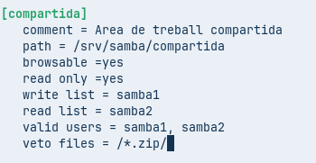
*Configuració per vetar arxius .zip*

Creem un arxiu .zip de prova:

```bash
echo "test" | sudo tee /srv/samba/compartida/prova.zip
```

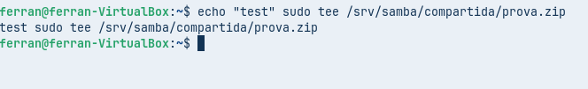
*Creació d'un arxiu .zip a la carpeta compartida*

Comprovem que no apareix des del client Windows:

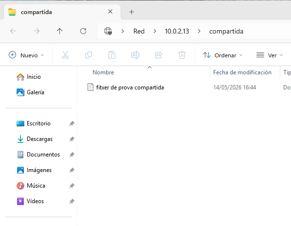
*L'arxiu .zip no es mostra des del client Windows*

---

## **Exercici 5: Samba des de Windows 11 a Linux**

### 5.1 Configuració de la carpeta compartida a Windows

Creem una carpeta a Windows i la compartim:

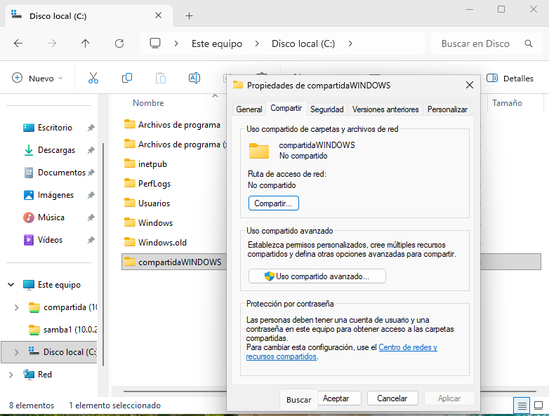
*Propietats de la carpeta a compartir des de Windows*

Configurem els permisos per "Everyone" amb només lectura:

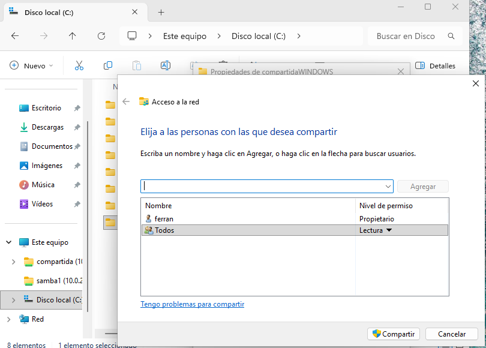
*Configuració de compartició amb l'usuari Everyone*

### 5.2 Accés des del client Linux (Zorin)

Instal·lem els paquets necessaris:

```bash
sudo apt install cifs-utils -y
```

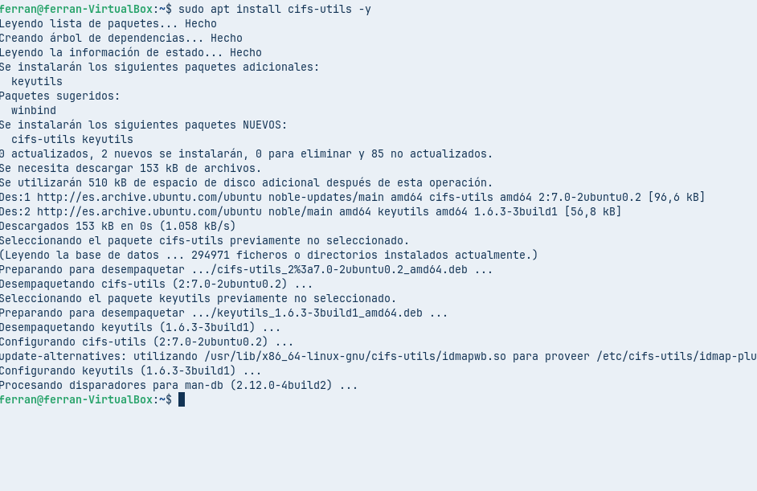
*Instal·lació de cifs-utils per muntar recursos Windows*

Creem un punt de muntatge:

```bash
mkdir ~/carpeta_WINDOWS
```

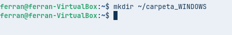
*Creació de la carpeta on muntarem el recurs de Windows*

Muntem el recurs compartit de Windows:

```bash
sudo mount -t cifs //10.0.2.11/compartidaWINDOWS ~/carpeta_WINDOWS -o username=ferran
```

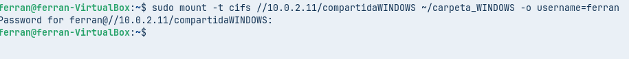
*Muntatge del recurs compartit de Windows*

Accedim correctament al recurs des de Zorin:

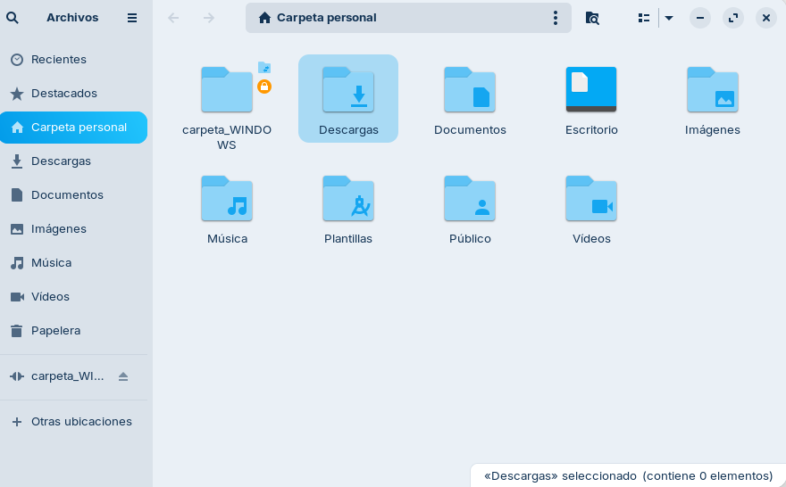
*Carpeta de Windows accessible des de Zorin amb permisos de lectura*

---

## **Resum de la configuració final**

### Fitxer `/etc/samba/smb.conf` complet:

```ini
[global]
workgroup = WORKGROUP
server string = %h server (Samba, Ubuntu)
server role = standalone server
map to guest = Bad User
log file = /var/log/samba/log.%m
logging = file

[publica]
comment = Carpeta Publica (Només Lectura)
path = /srv/samba/publica
browsable = yes
guest ok = yes
read only = yes

[homes]
comment = Directori personal de $u
browsable = no
read only = no
valid users = %S
create mask = 0700
directory mask = 0700

[compartida]
comment = Area de treball compartida
path = /srv/samba/compartida
browsable = yes
read only = yes
write list = samba1
read list = samba2
valid users = samba1, samba2
veto files = /*.zip/
```

### Configuració de xarxa:
- **Servidor Samba (Ubuntu)**: 10.0.2.13
- **Client Windows**: 10.0.2.11

### Usuaris configurats:
| Usuari | Carpeta personal | Accés compartida |
|--------|-----------------|------------------|
| samba1 | ✓ | Lectura/Escriptura |
| samba2 | ✓ | Només lectura |
| samba3 | ✓ | Sense accés |

---

