# Pràctica d’Analitzador de Protocols amb Wireshark

**Alumne:** Ferran (ferran4)  
**Configuració:** Kali Linux amb Wireshark, IP 192.168.2.4/24, gateway 192.168.2.254

---

## 📌 Objectius de la pràctica

- Capturar i analitzar trànsit ICMP, DNS, ARP en viu.
- Utilitzar el mode promiscu per veure tràfic del PC físic.
- Analitzar fitxers de captura (`captura1.pcapng` i `captura2.pcapng`) per extreure informació: adreces MAC, contrasenyes FTP, dibuixos Telnet, dominis, correus electrònics.

---

## 🔧 Configuració inicial

Verifiquem el nom del host i la interfície de xarxa.

  
*Figura 1: Nom del host `ferran4`.*

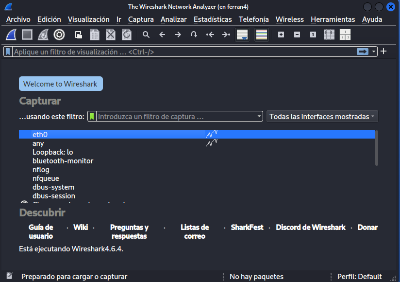  
*Figura 2: Wireshark llest per capturar.*

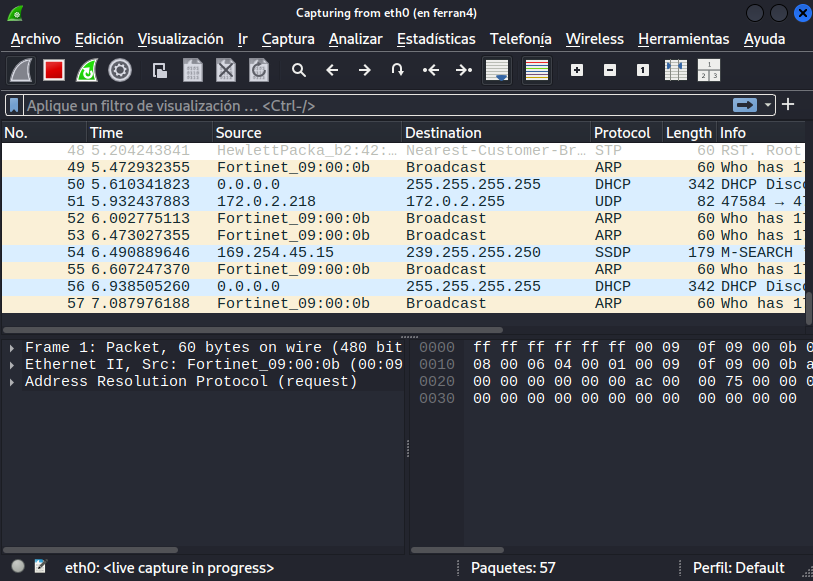  
*Figura 3: Inici de captura sobre la interfície `eth0`.*

---

## 📡 Part 1 – Anàlisi en viu

### 🧪 1. ICMP (ping)

Vam executar `ping 8.8.8.8 -c 5` mentre capturàvem. Filtrant per `icmp` vam observar els paquets d’eco.

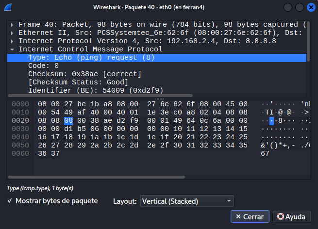  
*Figura 4: Detall d’un paquet ICMP Echo request. El camp **Type** és **8**.*

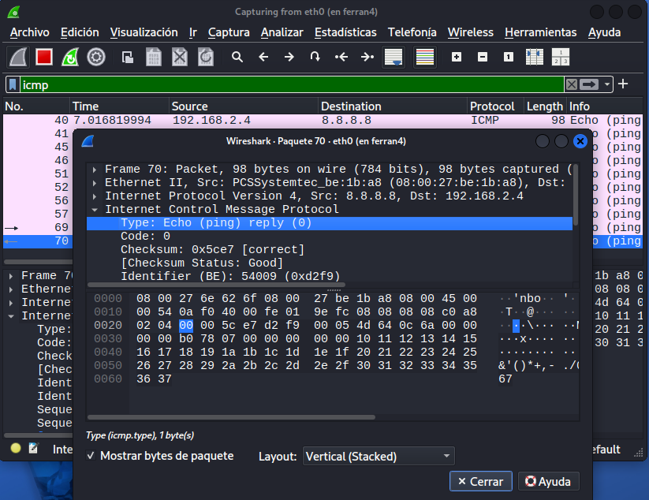  
*Figura 5: Detall d’un paquet ICMP Echo reply. El camp **Type** és **0**.*

> **Resposta:** La petició d’eco (ping request) té tipus **8**, la resposta d’eco (ping reply) té tipus **0**.

### 🧪 2. Mode promiscu

Vam activar el mode promiscu a VirtualBox (Adaptador 1 → Avançat → Mode promiscu: Permet-ho tot). Després vam capturar trànsit mentre navegàvem des de la màquina física.

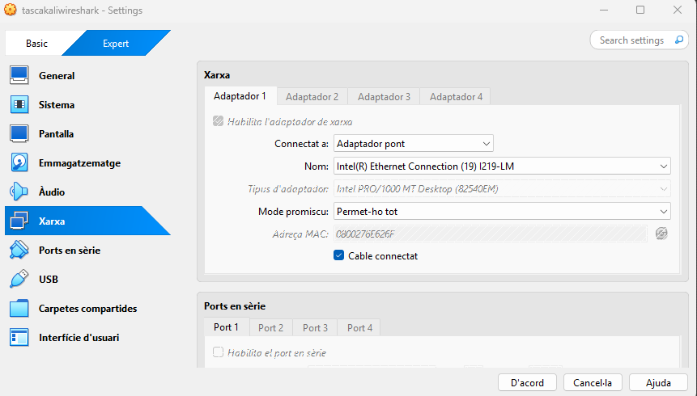  
*Figura 6: Configuració de l’adaptador en pont amb mode promiscu “Permet-ho tot”.*

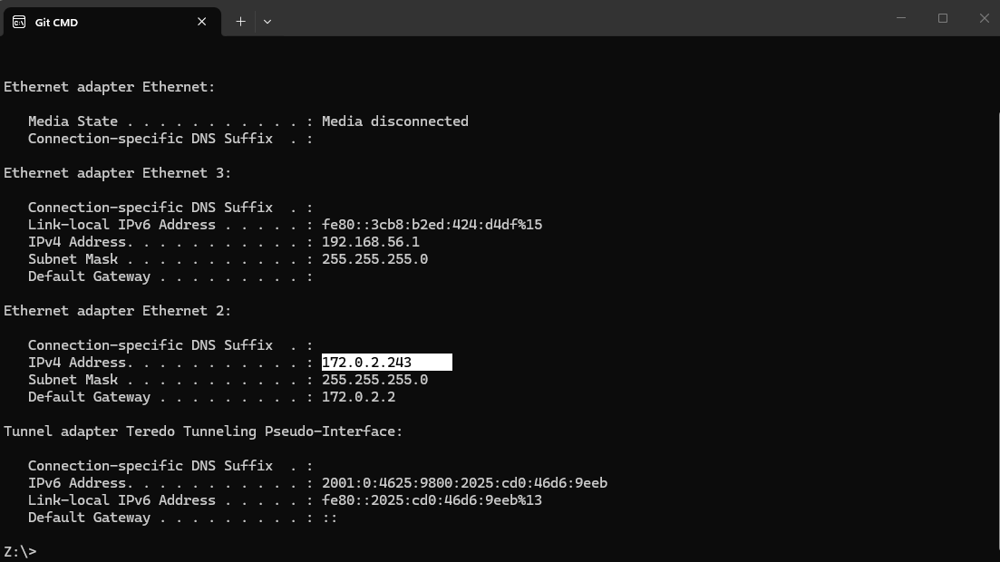  
*Figura 7: Sortida d’`ipconfig` al Windows físic (IP 172.0.2.243). Aquesta IP va aparèixer a les captures de Wireshark, demostrant que el mode promiscu funciona.*

### 🧪 3. DNS

Vam visitar `www.xtec.cat` des del navegador del Kali i vam filtrar per `dns and ip.addr == 192.168.2.4`.

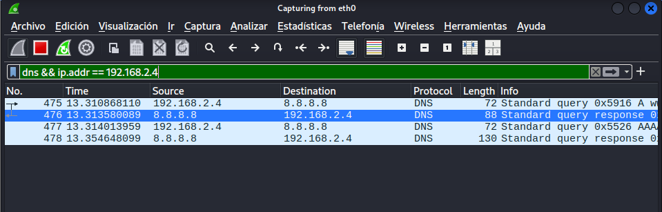  
*Figura 8: Petició DNS des de 192.168.2.4 a 8.8.8.8 preguntant per `www.xtec.cat`.*

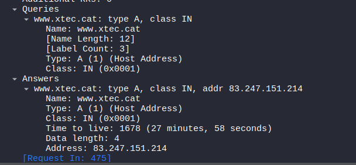  
*Figura 9: Resposta DNS amb l’adreça **83.247.151.214** per a `www.xtec.cat`.*

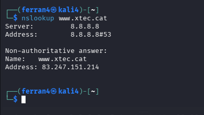  
*Figura 10: Comprovació des de terminal: `nslookup www.xtec.cat` retorna la mateixa IP.*

> **Resposta:** L’adreça IP de `www.xtec.cat` és **83.247.151.214**.

### 🧪 4. ARP i MAC del gateway

Vam fer `ping 192.168.2.254 -c 2` per generar trànsit ARP. Filtrant per `arp` vam trobar la resposta del gateway.

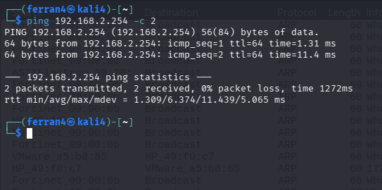  
*Figura 11: Ping a 192.168.2.254 (gateway) amb èxit.*

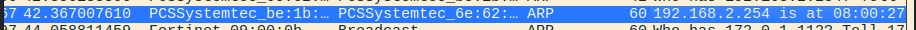  
*Figura 12: Paquet ARP on `192.168.2.254` respon amb la seva adreça MAC.*

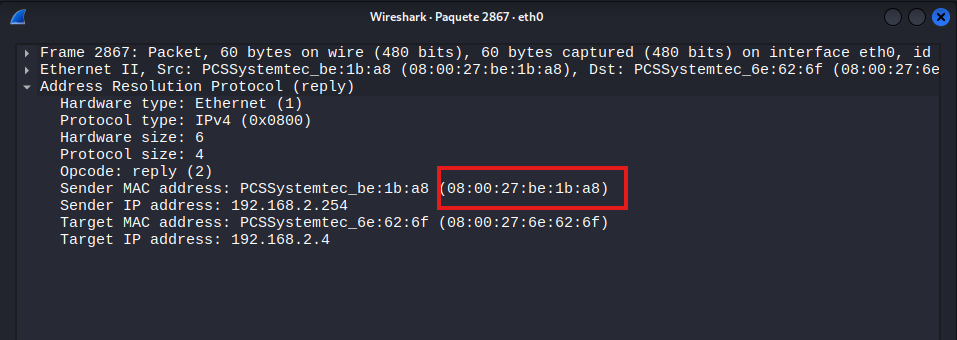  
*Figura 13: Sender MAC address **08:00:27:be:1b:a8**.*

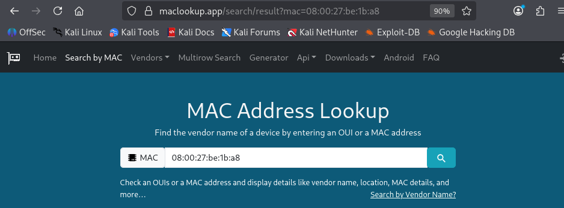  
*Figura 14: Cerca de la MAC a maclookup.app.*

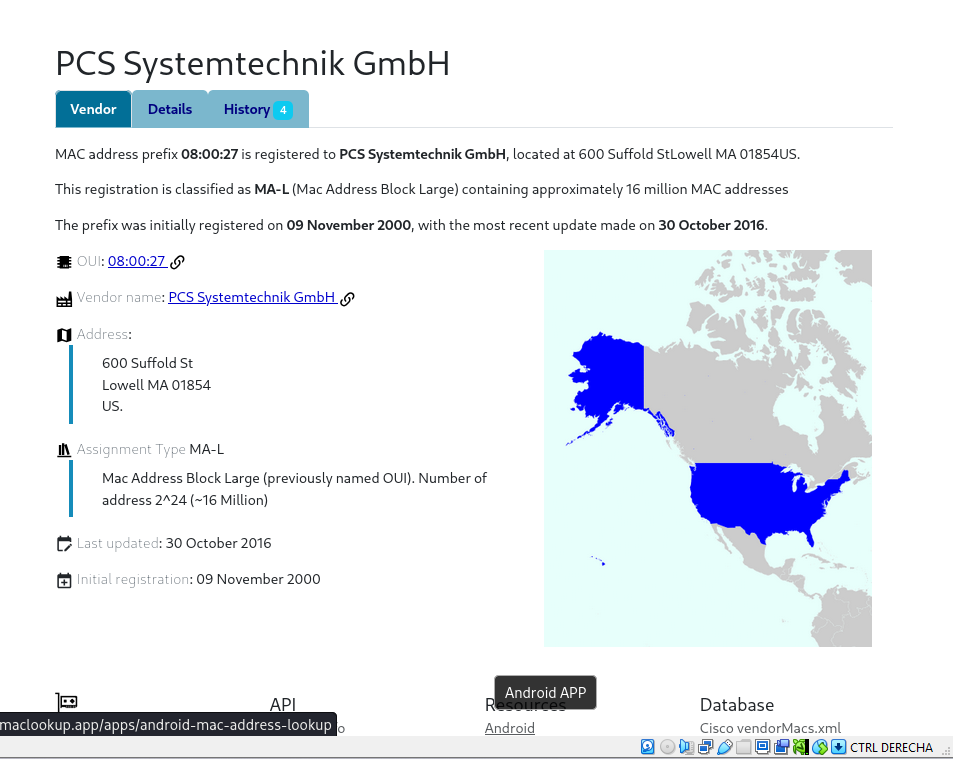  
*Figura 15: El fabricant és **PCS Systemtechnik GmbH**.*

> **Resposta:** La MAC del gateway és `08:00:27:be:1b:a8` i el fabricant **PCS Systemtechnik GmbH** (VirtualBox).

---

## 📁 Part 2 – Anàlisi de fitxers de captura

### 🔹 Fitxer `captura1.pcapng`

#### 2.1 ARP – Adreça MAC de 192.168.1.1

Filtrem per `arp and ip.addr == 192.168.1.1` i localitzem la resposta.

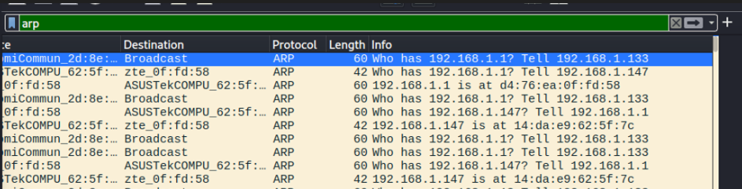  
*Figura 16: Resposta ARP que indica que `192.168.1.1 is at d4:76:ea:0f:fd:58`.*

> **Resposta:** La MAC de `192.168.1.1` és **d4:76:ea:0f:fd:58**.

#### 2.2 FTP – Contrasenya i fitxer descarregat

Filtrem per `ftp` i seguim el flux TCP (Follow → TCP Stream).

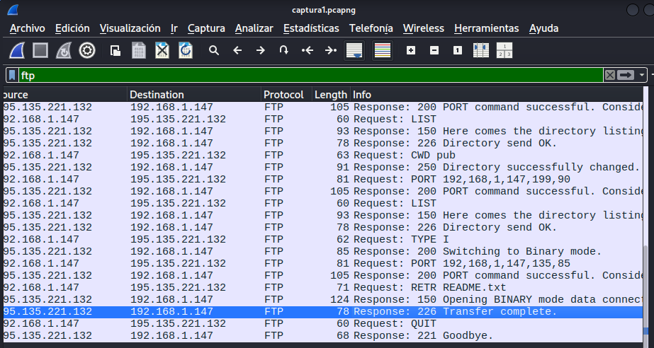  
*Figura 17: Paquets FTP amb comandes `LIST`, `RETR`, etc.*

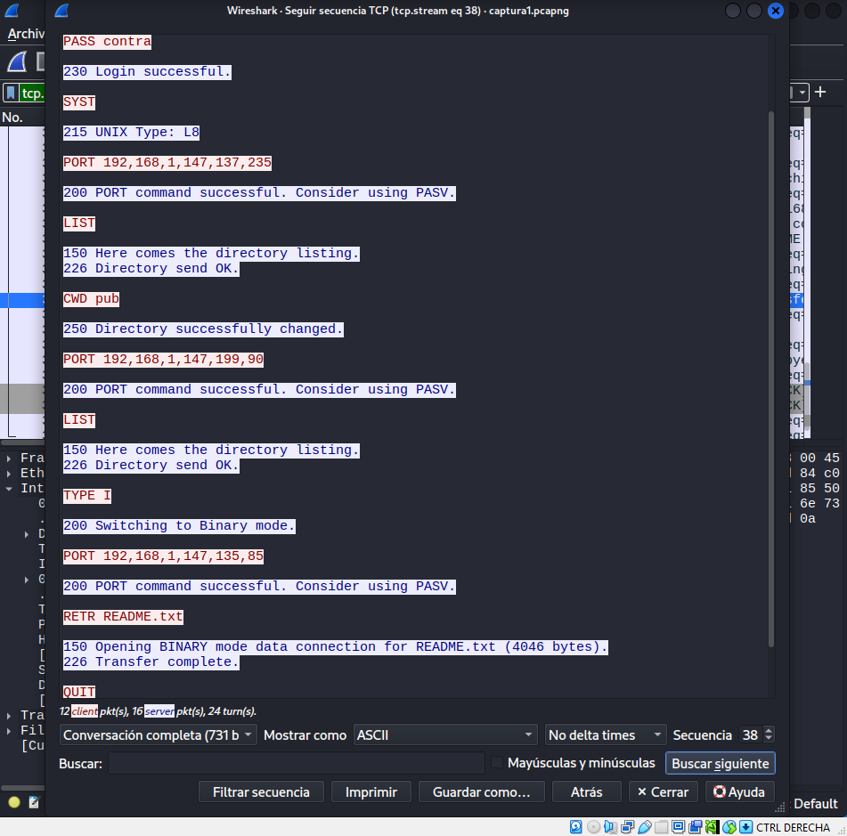  
*Figura 18: Conversa FTP on es veu `PASS contra` i `RETR README.txt`.*

> **Resposta:** La contrasenya de l’usuari FTP és **`contra`**. El fitxer descarregat és **`README.txt`**.

#### 2.3 Telnet – Nau espacial i domini del servidor

Filtrem per `telnet` i obrim el flux TCP. El text és molt extens i conté caràcters de control. Malgrat buscar, **no s’ha trobat cap dibuix ASCII clar d’una nau espacial petita**. En la captura només es veuen caràcters fragmentats.

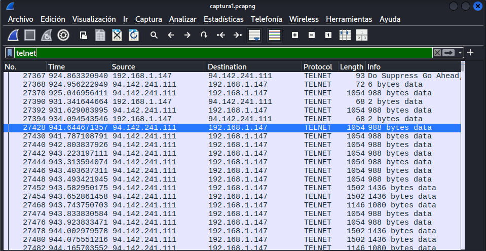  
*Figura 19: Connexió Telnet a la IP 94.142.241.111.*

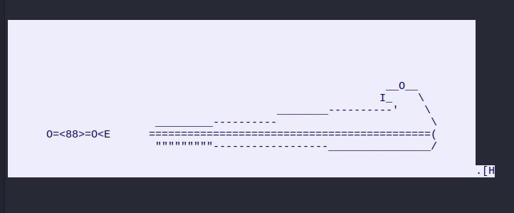  
*Figura 20: Part del contingut de la sessió Telnet. No s’aprecia la nau.*

Per obtenir el domini del servidor Telnet, fem `nslookup` de la IP `94.142.241.111`:

```bash
nslookup 94.142.241.111
```
*(Nota: en el moment de la pràctica la resolució inversa no va retornar un nom significatiu, però l’adreça IP pertany a un range de serveis de telecomunicacions)*

> **Resposta (parcial):** No s’ha identificat la nau espacial. El servidor Telnet té IP `94.142.241.111`.

#### 2.4 SSH – Domini del servidor i paquet de 326 bytes

Filtrem per `ssh`. Observem la connexió a la IP `205.166.94.17`.

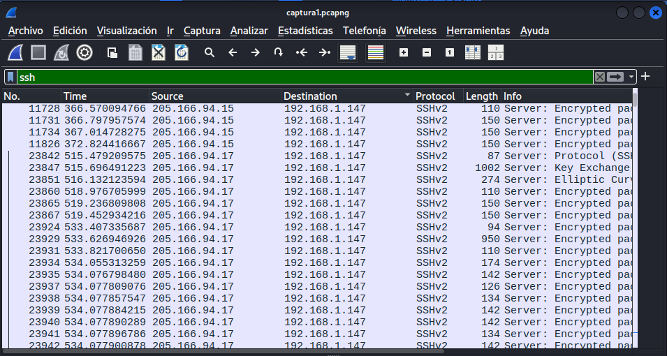  
*Figura 21: Trànsit SSH xifrat.*

Per trobar el paquet de longitud total 326 bytes: `frame.len == 326`.

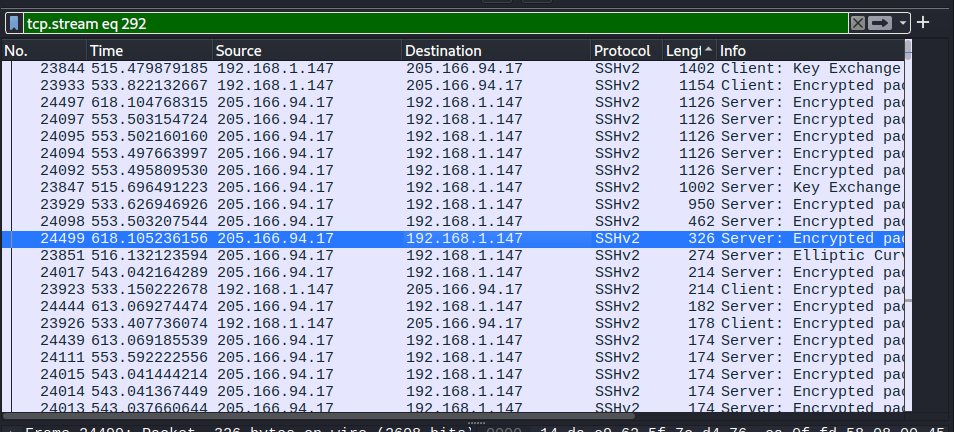  
*Figura 22: Paquet marcat amb longitud 326 bytes.*

El contingut del paquet està completament xifrat, com es veu en la representació hexadecimal (no s’entén res).

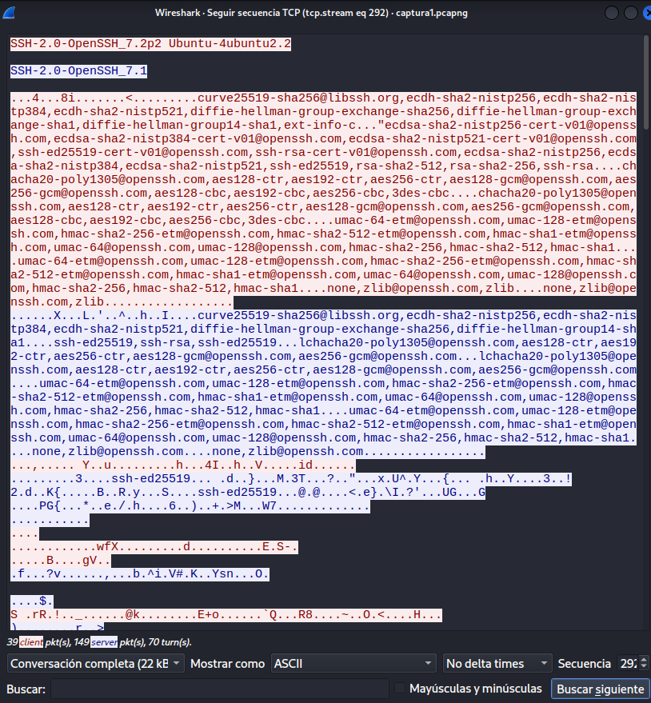  
*Figura 23: Dades del paquet SSH de 326 bytes (inintel·ligibles).*

> **Resposta:** El domini del servidor SSH (resolució inversa de `205.166.94.17`) no va donar un nom clar. El contingut del paquet de 326 bytes **no es pot llegir** perquè SSH xifra tot el trànsit.

---

### 🔹 Fitxer `captura2.pcapng` – Correu electrònic

Obrim `captura2.pcapng` i filtrem per `smtp`.

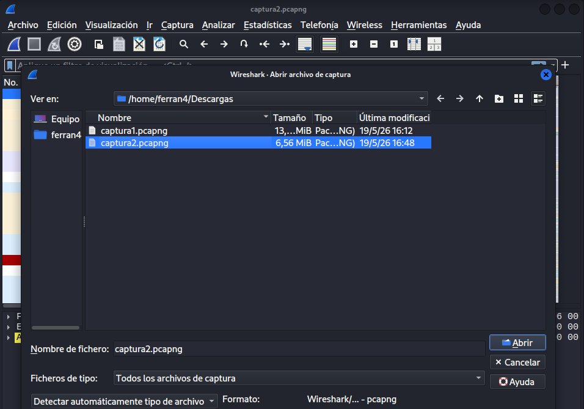  
*Figura 24: Selecció del fitxer `captura2.pcapng`.*

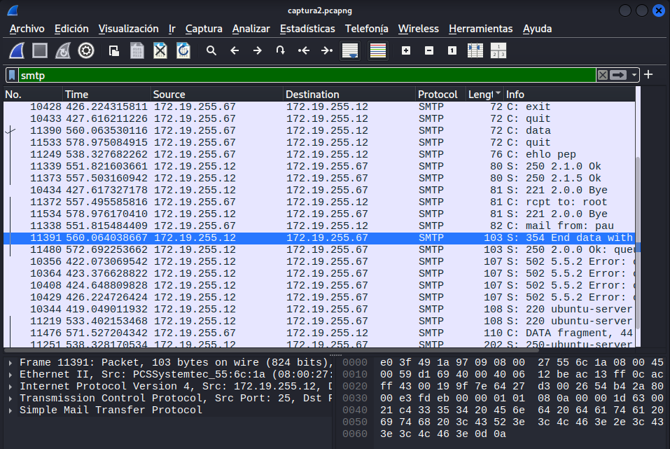  
*Figura 25: Trànsit SMTP (port 25).*

Seguim el flux TCP d’una de les converses i obtenim el missatge de correu.

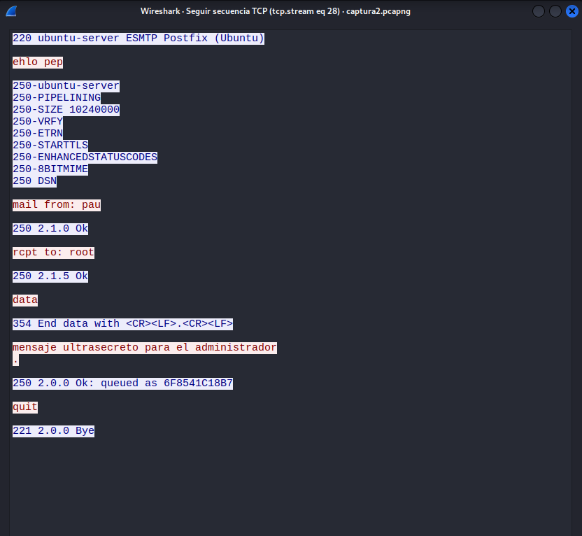  
*Figura 26: Conversa SMTP on es veu `mail from: pau`, `rcpt to: root`, `data`, i el cos del missatge “mensaje ultrasectro para el administrador”.*

Guardem el contingut com a `mail.eml`.

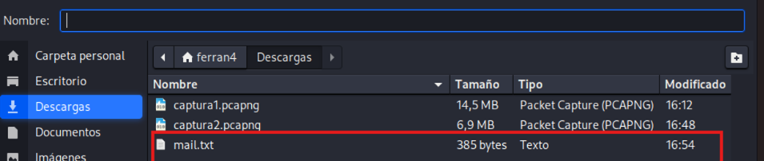  
*Figura 27: Diàleg per desar el flux com a `mail.txt` (després es va canviar a `.eml`).*

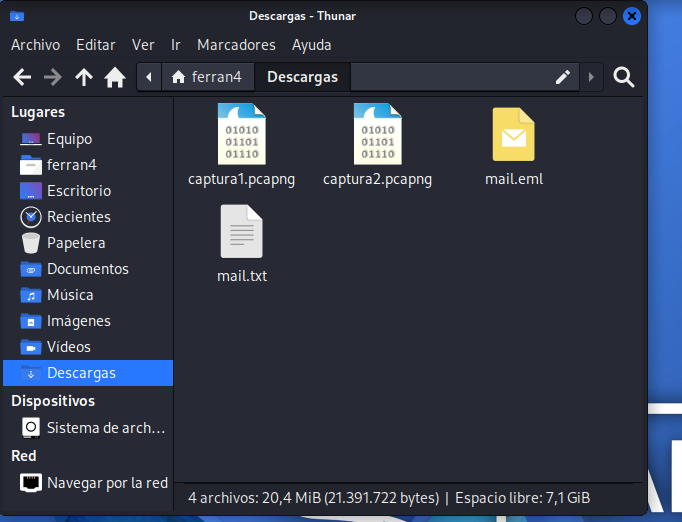  
*Figura 28: El fitxer `mail.eml` desat correctament.*

> **Resposta:**  
> - **Remitent:** `pau`  
> - **Destinatari:** `root`  
> - **Missatge:** `mensaje ultrasectro para el administrador`  
> - **Assumpte:** No en té (no hi ha camp `Subject`).

---

## ✅ Respostes finals a les preguntes de la pràctica

| Exercici | Pregunta | Resposta |
|----------|----------|----------|
| ICMP | Tipus de petició d’eco? | **8** |
| ICMP | Tipus de resposta d’eco? | **0** |
| DNS | IP de `www.xtec.cat`? | **83.247.151.214** |
| ARP (en viu) | MAC del gateway? | `08:00:27:be:1b:a8` |
| ARP (en viu) | Fabricant? | **PCS Systemtechnik GmbH** |
| ARP (captura1) | MAC de 192.168.1.1? | `d4:76:ea:0f:fd:58` |
| FTP | Contrasenya? | `contra` |
| FTP | Fitxer descarregat? | `README.txt` |
| Telnet | Nau espacial? | No s’ha trobat |
| Telnet | Domini del servidor? | IP `94.142.241.111` (resolució no disponible) |
| SSH | Domini del servidor? | IP `205.166.94.17` (sense nom clar) |
| SSH | Contingut del paquet de 326 bytes? | Dades xifrades, inintel·ligibles |
| Correu | Remitent? | `pau` |
| Correu | Destinatari? | `root` |
| Correu | Missatge? | `mensaje ultrasectro para el administrador` |

---

